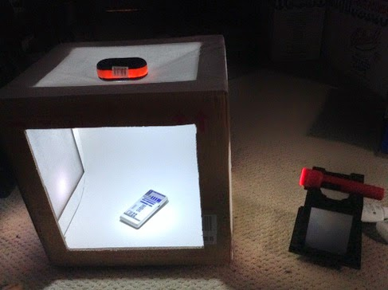
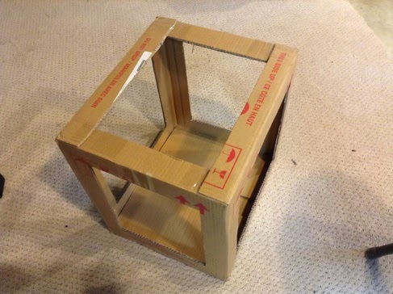
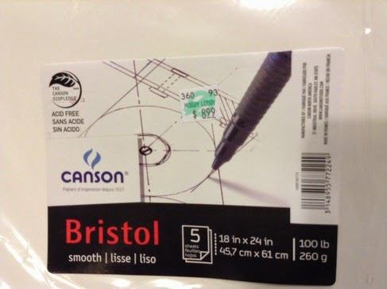
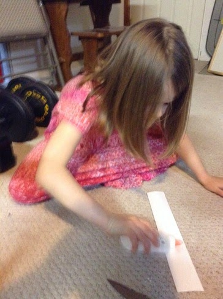
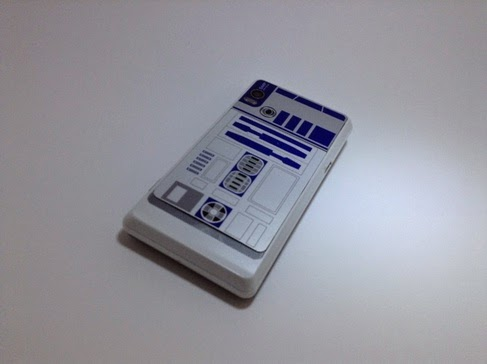

Title: Light Box
Date: 2014-05-11
Tags: Maker, 3DPrinting

{ width=200, align=right, hspace=10}

In addition to making, I love to take pictures. Photography has been a passion
of mine since I was my daughter's age. I remember one vacation in Lake
Michigan with my family: my Aunt Pat gave me a 110 cartridge camera and
basically just let me loose. I was hooked. The only problem with my habit was
the cost of developing film, which I tried to pay for in high school by
working at a one hour developing store and in college by working on the
newspaper and yearbook. Finally, even though the resolution was poor, digital
cameras allowed me to feed my habit - and as they continuously get better I
haven't looked back.  

I found the plans for this light box on the internet (<http://digital-photography-school.com/how-to-make-a-inexpensive-light-tent>) and thought it
would make a good project for me and my kids. A light box will also come in
handy if we need to take pictures of the things we are making.  

The first step was to measure and cut the box. This is where we got stuck
because the cardboard paper I had was a little old and yellowish. I wanted
something cleaner so I had to set this project aside until I could by some
better cardboard (and cloth, while I was at it).  

{ width=200, align=right, hspace=10}

I ended up buying Bristol board as recommend in the blog post. It has a nice
smooth finish and I think it will work well.  

{ width=200, align=right, hspace=10}

My daughter and I cut out strips of the board and glued them to the box.  

{ width=200, align=right, hspace=10}

Once glued, we added the cloth and tested it out on my android phone.  This looks okay, although I think I need some better (and brighter) lights -
but this looks to be a good start.  

{ width=200, align=right, hspace=10}

Blogpost migrated from [Blogger](https://apprenticemaker.blogspot.com/2014/05/light-box.html) using costom python script. Comment on errors below.
