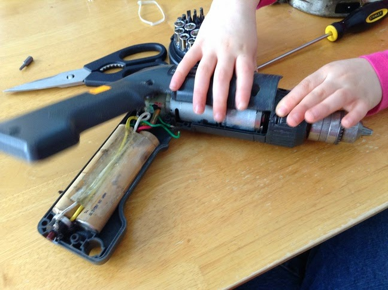
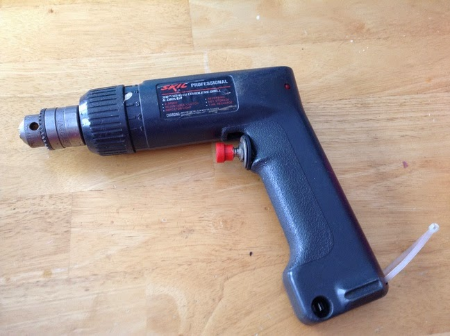
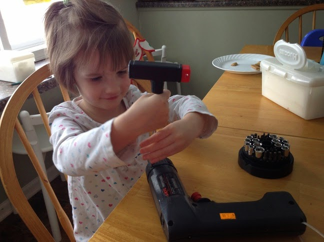
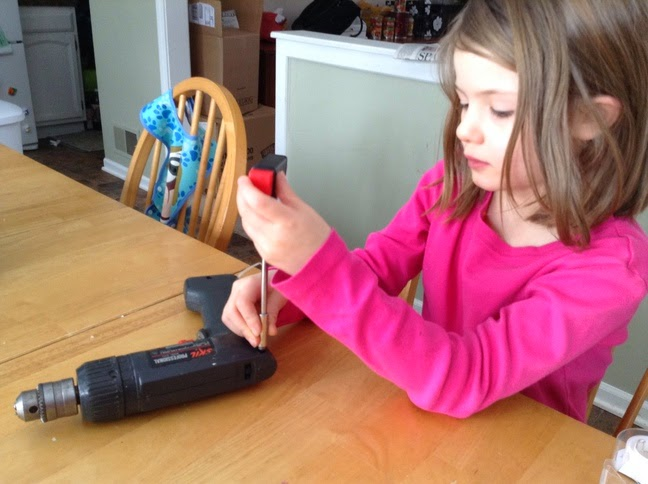
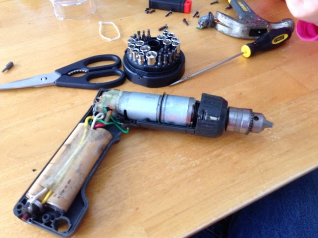

Title: Reverse Making
Date: 2014-05-11
Tags: Maker, 3DPrinting

{ width=200, align=right, hspace=10}

I paid a visit to our university's surplus store. This is a wonderful place
where the university can recycle and reuse some of its vast equipment and
supplies. It turns out to be a big junk store. My goal was to find something
useful that I could take apart with my kids; I came across this $3 drill that
someone had already modified. You can tell by the after market trigger switch.  

{ width=200, align=right, hspace=10}

My daughters and I took this drill apart to see how it works. The girls loved
the activity.  

{ width=200, align=right, hspace=10}

{ width=200, align=right, hspace=10}

We had some trouble getting the chuck off, but overall it was a great way to
spend an hour on Saturday. I was just going to throw away the drill, but I
think the motor and gearbox may come in handy for a future project.  

{ width=200, align=right, hspace=10}

I like the idea of reverse making. This is an activity well-suited for younger
kids. I plan to hit the garage sales this summer looking for things we can
take apart and recycle or reuse for parts. Maybe we will build a robot!

Blogpost migrated from [Blogger](https://apprenticemaker.blogspot.com/2014/05/i-paid-visit-to-our-universities.html) using costom python script. Comment on errors below.
