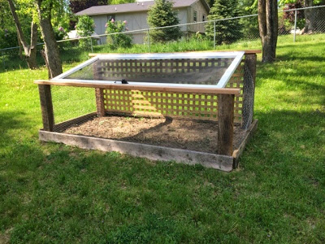
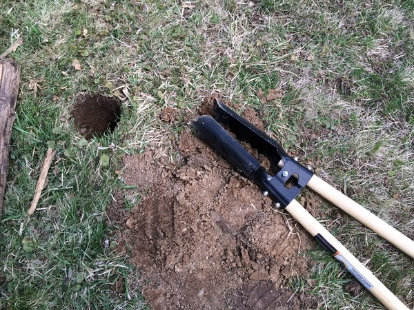
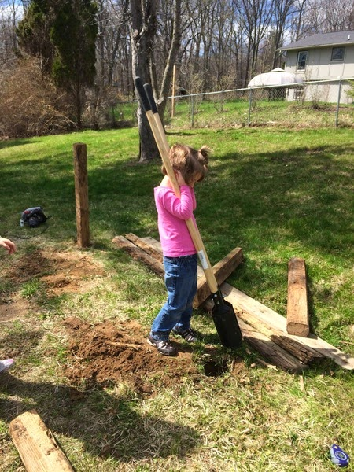
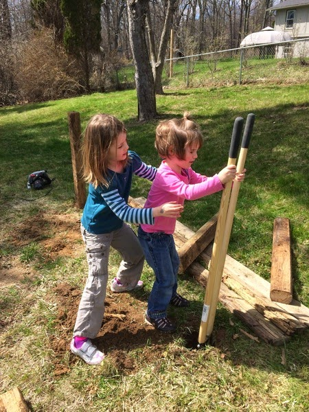
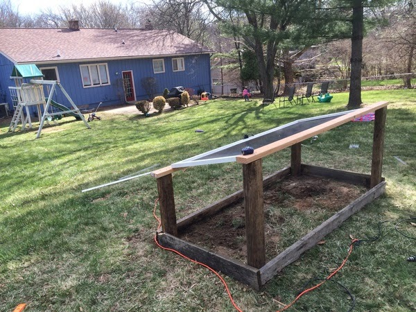

Title: Garden Fortress
Date: 2014-05-24
Tags: Maker, 3DPrinting

I love the idea of gardening. Specifically vegetable gardens where we can
grow, harvest and eat some of our food.  I've had a few gardens before, but in
our current house it is difficult to have one because our beautiful four
legged neighbors (deer) like to snack in our yard.  

I got this idea from a community garden just down the road.  They used an old
glass door as a small green house.  I am using the same idea but as a
screened-in space for a little garden.  

I got the door from our local Habitat resale store and it works great.  

Here is a picture of the final product. Note, that the door opens for easy top
access and the back can be easily removed also by lifting it off the screws I
use as hooks.  

Here are a few pictures of my kids and me making the garden.  

I also recently posted this as my first project on instructables:  

<http://www.instructables.com/id/Garden-Fortress-to-stop-deer-and-other-vegetable-p>  

Send me pics if you make your own.

\- Dirk

Blogpost migrated from [Blogger](https://apprenticemaker.blogspot.com/2014/05/garden-fortress.html) using costom python script. Comment on errors below.
