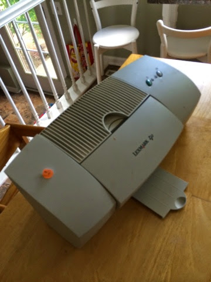

Title: Scavenging Parts
Date: 2014-05-24
Tags: Maker, 3DPrinting

I found this printer at a garage sale for $2.  

I like to find old mechanical/electrical devices and take them apart with my
kids.  

In addition to just having fun and learning how things work, we were able to
salvage the stepper motors.  I want to try hooking them up to the Arduino
(<http://www.arduino.cc/>) that my brother gave me for Christmas.  If it
works, we are going to try and make a reprap (<http://reprap.org/>) using
parts printed from my Ultimaker 2 (<https://www.ultimaker.com/>).  

\- Dirk  

Blogpost migrated from [Blogger](https://apprenticemaker.blogspot.com/2014/05/scavaging-parts.html) using costom python script. Comment on errors below.
