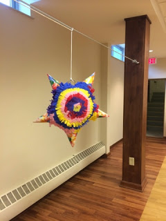

Title: Party Piñata
Date: 2014-06-12
Tags: Maker, 3DPrinting

I like to watch Curious George with my Kids.  That little monkey is a bit of a
maker. I really like the episodes where he tries to build things.  In most
cases he doesn't get his design right and has to debug and iterate on the
design until he has what he wants. It is a very good lesson for our young
makers.  

In one episode George decides to make a piñata.  My youngest daughter LOVEs
this episode and has been asking my wife and I to make a piñata for weeks.  A
few weeks ago my wife relented and found a really nice youtube tutorial on-
line:  

We got the supplies suggested by the video and my wife and kids started paper
machine a star shaped balloon and party hats.  The family ended up making two
since the overall costs were about the same.  

We filled them with candy and put one of them to the test this weekend at a
family party:  

The only problem we had was keeping the piñata attached to the string.
Ultimately, I had to tie the string around the whole thing to get it to stay.
I probably need to follow George's example by iterating and engineering a
better process for the second one.  

\- Dirk  

Blogpost migrated from [Blogger](https://apprenticemaker.blogspot.com/2014/06/party-pinata.html) using costom python script. Comment on errors below.
