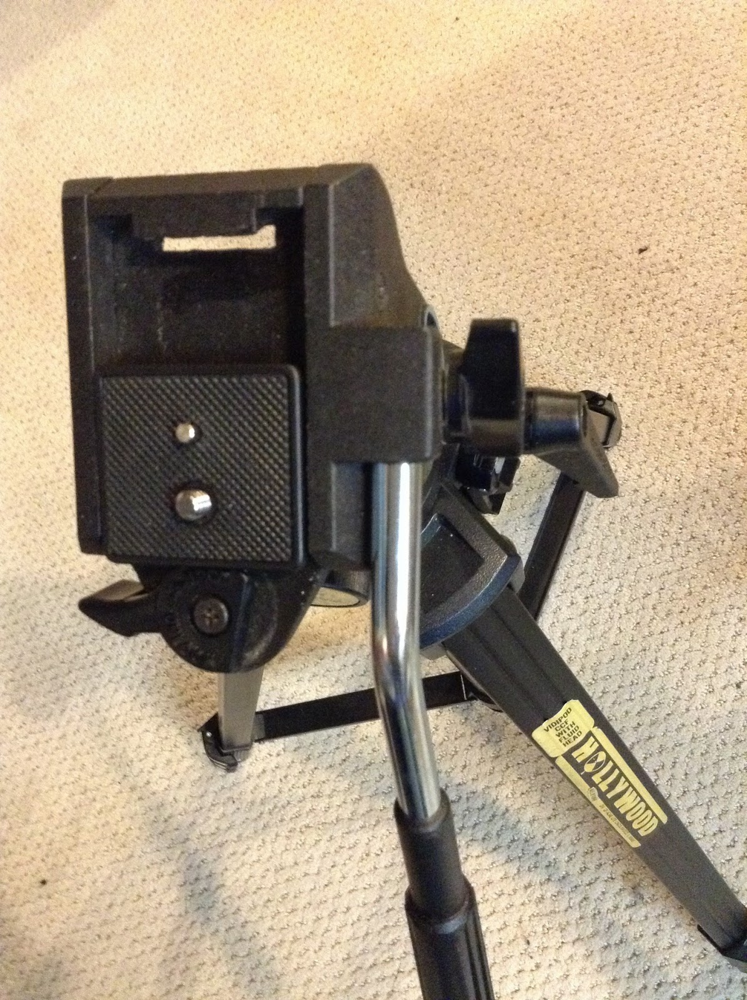
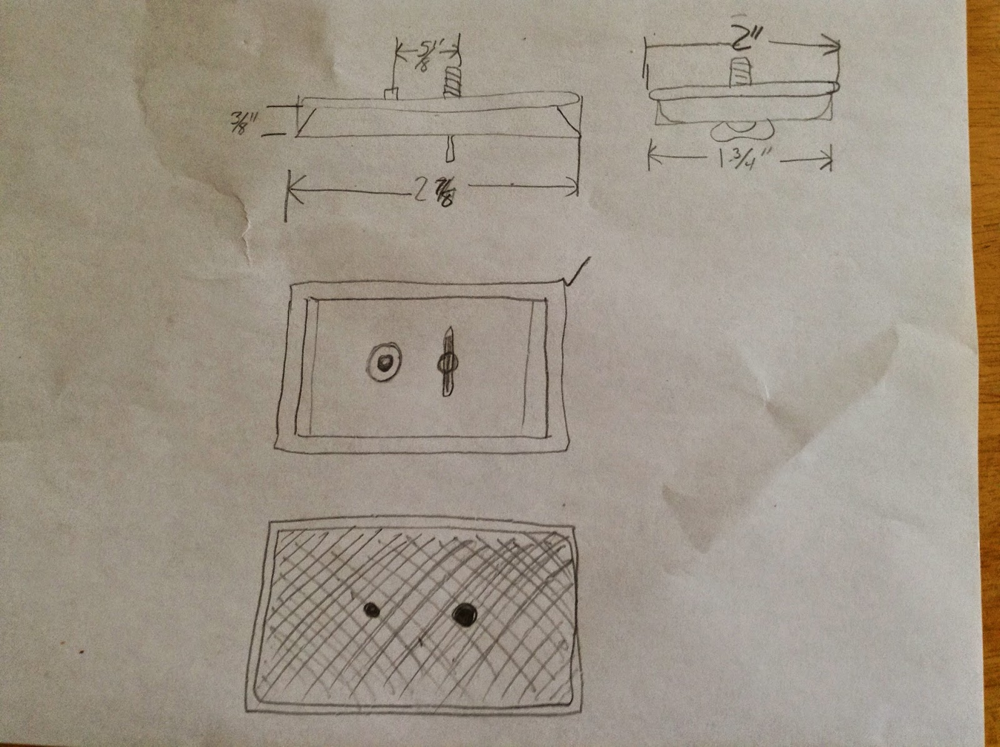
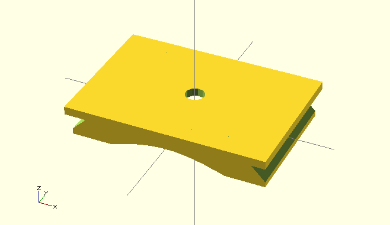
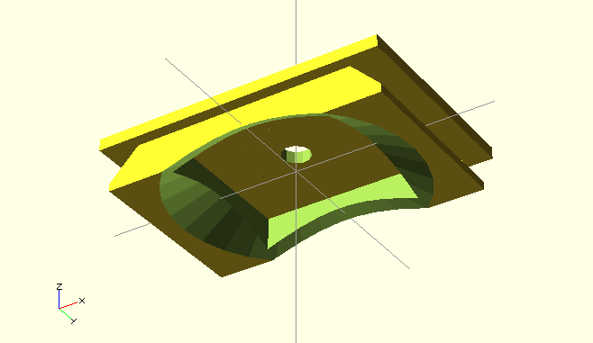
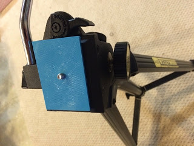

Title: Tripod Quick release mount
Date: 2014-06-13
Tags: Maker, 3DPrinting

I got a tripod for my birthday this year.  It is a really nice one, but I lost
the quick release mount.  Here is a picture with a quick release mount from
another tripod. Obviously, it doesn't fit:  

{ width=200, align=right, hspace=10}

After some shopping online this one looks fairly good, but possibly not the
right size.  

<http://www.tripodquickrelease.com/Acme_Lite_Quick_Releases.htm>  

So, I took some measurements and came up with this drawing  

{ width=200, align=right, hspace=10}

My goal is to see if I can print this out using a 3D printer. When I started
this project I was planning to use the one in the engineering department where
I work, but now I have an Ultimaker 2.  I know I need an stl file but I was
not sure the best way to generate one. After some quick internet searching I
found openscad.  

<http://www.openscad.org/>  

I downloaded the software and found the wiki quick start page.  It did not
take long to figure out the simple language.  I started by making a cube and
then creating the top.  Then I made objects to cut out the inside and the
bevels.  Here is the resulting model.  

{ width=200, align=right, hspace=10}
{ width=200, align=right, hspace=10}

The hardest part was to get the surface normals for the wedge shape object to
face in the right direction.  However, once I drew out my points and used the
right hand rule things settled in nicely.  Openscad outputs stl files so all I
did was import it into the cura program to generate the gcode for my printer
and save it to the SD card to print.  The first print was a little too close
to my tolerances and I could not get it to fit inside the tripod.  However,
with some simple modifications to the openscad file I was able to generate a
quick release mount that I think looks quite nice and works well:  

{ width=200, align=right, hspace=10}

A future design would fix the bottom to the mount somehow. I posted the STL
and OpenScad files on YouMagin.org if you are interested in makeing your own:  

<https://www.youmagine.com/designs/tripod-quick-release-mount>  

\- Dirk  

Blogpost migrated from [Blogger](https://apprenticemaker.blogspot.com/2014/06/tripod-quick.html) using custom python script. Comment on errors below.
