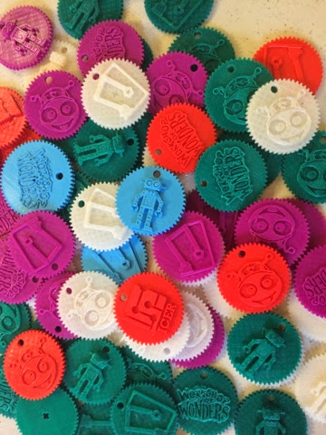
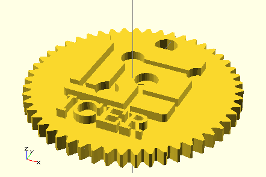
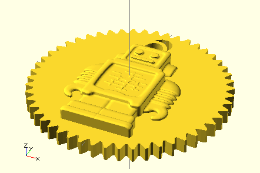

Title: Gears with logos
Date: 2014-06-22
Tags: Maker, 3DPrinting

{ width=200, align=right, hspace=10}

The theme for the kids VBS (Vacation Bible School) this year is "Workshop of
Wonders" by [Cokesbury](http://2014.cokesburyvbs.com/).  I participate every
year with my kids but was extremely enthusiastic that the theme this year was
for makers so my goal is to show off the 3D printer and make some things for
the 50 or so kid participants.  It's no fun watching a 3D printer without
having something to touch and even take home.  However, I am fairly new to 3D
print design so this was only my second endeavor to design something of my
own.  

I was trying to think of a project where each student would get a gismo to
take home but we could put them all together to build something as a group.
This fit in with the theme quite nicely however most of my ideas were a little
too complex to get off the ground.  

I finally settled on building gears with logos and holes on one end so they
could attach them to their backpacks.  I thought I could assemble all of the
gears together to make one big machine the kids could play with that all
worked together.  With this plan in mind I searched though thingiverse and
youmagin for some designs I could use as a starting point.  I was really
excited when I found this one by <http://www.thingiverse.com/thing:40410> that
can be used to make gears that fit into Lego technics. I have a ton of lego
technics and I really liked the idea that the motivated students to integrate
their gear with their own legos.  

After some iteration, I ultimately ended up doing is importing the images into
Inkscape and converting them to a dfx file which is a vector map using
instructions I found on a couple of website. Here is an example image I loaded
into Inkscape  

{ width=200, align=right, hspace=10}
{ width=200, align=right, hspace=10}

Using this technique I was able to make a variety of gears and they worked
well with lego. Here is a video of one of the gears working with my old first
generation mindstorm:  

This turned out to be a really flexible design and I was also able to someone
elses openscad files to make other gears with different projects I found on
thingiverse. For example here is one with a robot in a openscad file from
thingiverse <http://www.thingiverse.com/thing:53285>:  

Here is another one from an stl file I found on youmagin that originally was a
keychain modification for the ultimaker
(<https://www.youmagine.com/designs/ultimaker-key-fob-flat>):  

I really like this design because it is easy for me to swap out different
logos based on the event.  I uploaded my source files and these examples to
github:  

<https://github.com/colbrydi/gear-givaways>  

And posted a few on Youmagine.org  

<https://www.youmagine.com/designs/gear-givaways>  

Please let me know if you find this helpful and email me links to gears that
you have made.

\- Dirk

Blogpost migrated from [Blogger](https://apprenticemaker.blogspot.com/2014/06/gears-with-logos.html) using custom python script. Comment on errors below.
