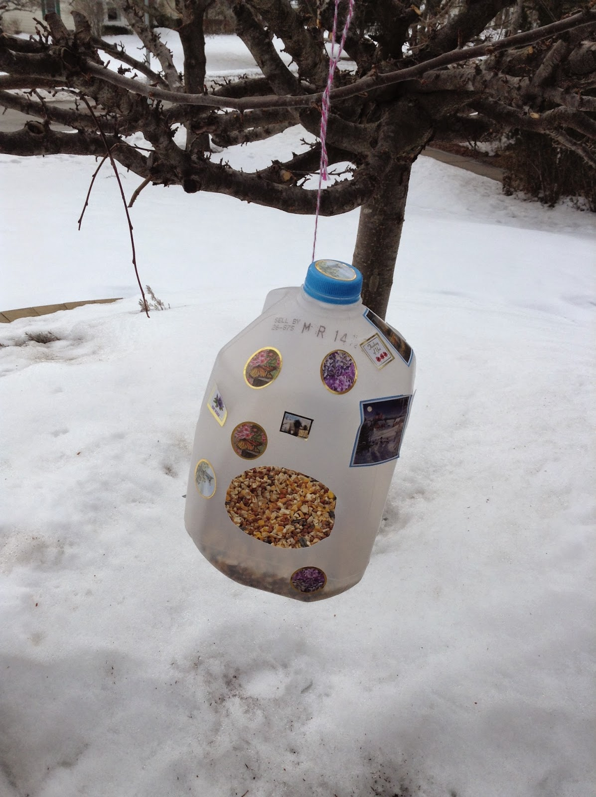
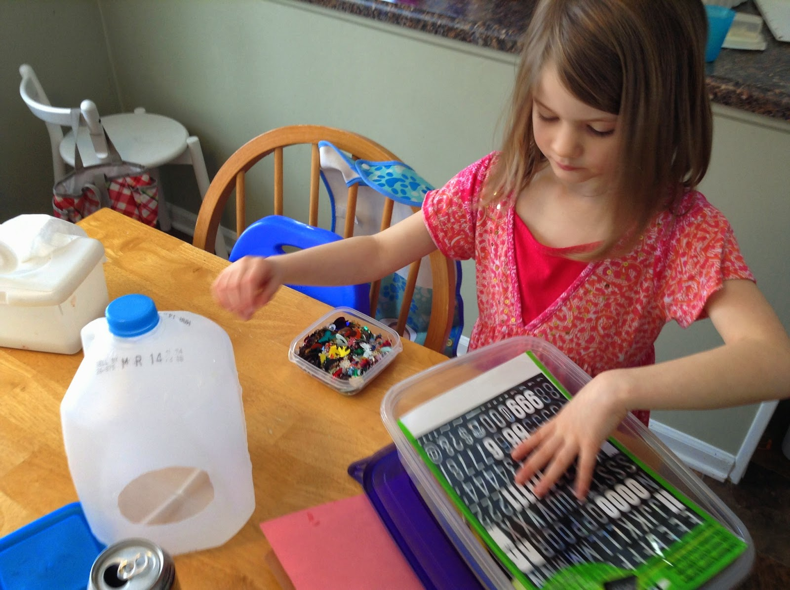
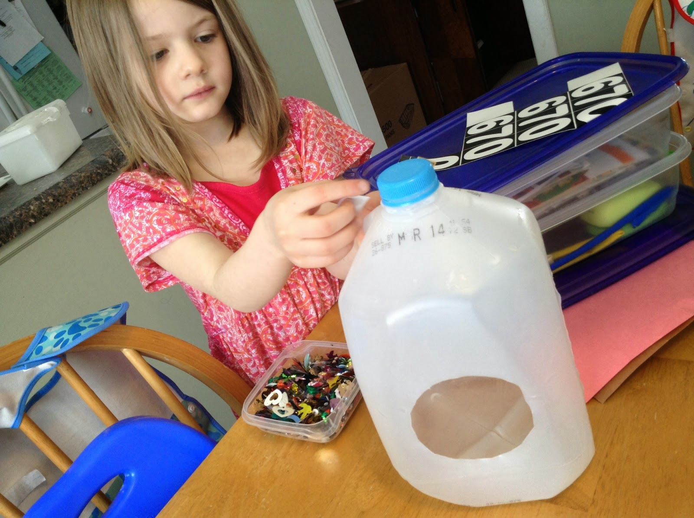
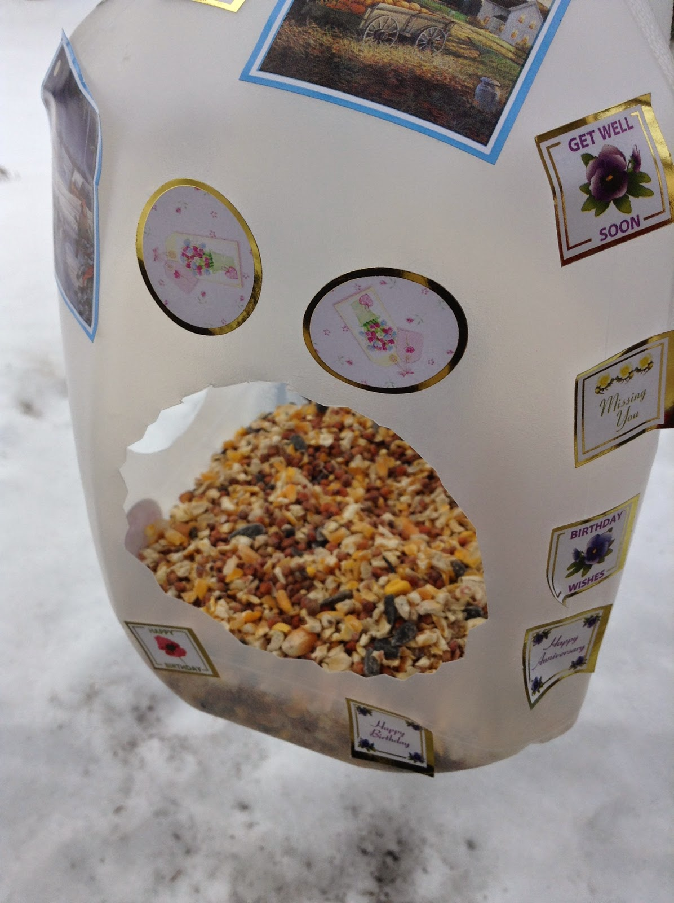

Title: Milk Jug Bird Feeder
Date: 2014-06-22
Tags: Maker

{ width=200, align=right, hspace=10}

My eldest daughter wanted to make a birdhouse/feeder.  It was the middle of
winter and I think she was thinking of building it out of wood. However, I
realized what she really wanted to do was decorate it using some extra
stickers she had.  So, we compromised and I cut out a hole in a washed out
milkjug.  

She spent the afternoon decorating and had a lot of fun.

{ width=200, align=right, hspace=10}

{ width=200, align=right, hspace=10}

Add a little birdseed and the project was complete.  

{ width=200, align=right, hspace=10}

Easy way to entertain a fidgety girl on a beautiful but cold afternoon.  The
seeds ended up on the ground although I don't ever think I saw a bird.  

\- Dirk

Blogpost migrated from [Blogger](https://apprenticemaker.blogspot.com/2014/06/milk-jug-bird-feeder.html) using customs python script. Comment on errors below.
