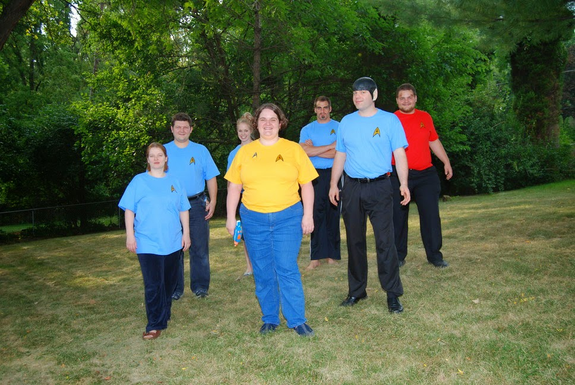
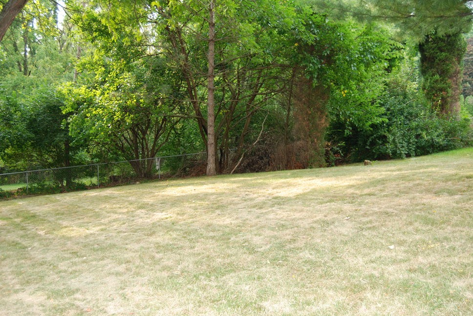
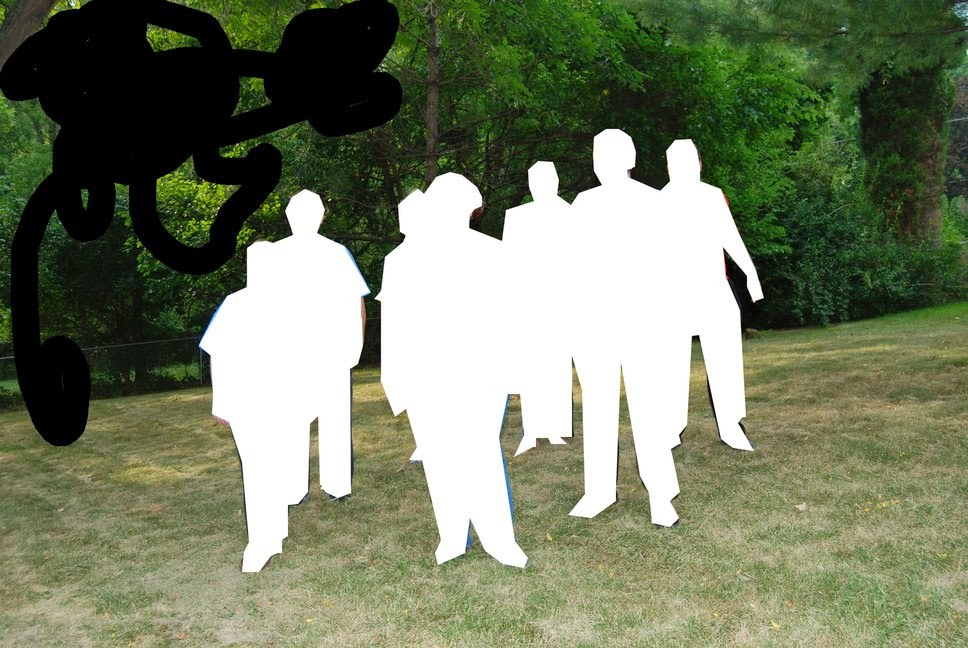

Title: BackBlog - Teleporter video
Date: 2014-07-19
Tags: Maker

We through a Star Trek themed surprise party for my wife and I thought it
would be fun to see if I could make a transporter effect.  

{ width=200, align=right, hspace=10}

To start we took two pictures, one with everyone in an away team formation and
one with just the background  

{ width=200, align=right, hspace=10}

I then wrote a simple program to add the two images together using a weighted
sum.  This technique looked okay but I also wanted some noise.  I used the
matlab imnoise function to create some sparkles. Inicially just a few, grow to
a lot about halfway and then disparate as the people materialize.  

The trick is to get the speckles to only appear where there are people.  I
could have tried some clever image subtraction trick to find the region that
changed but it was just as quick for me to use GIMP to cut the people out and
make a simple flag array using the following Matlab code.  I had to also use
GIMP to paint over any white spots in the image. Fortunately for my image
there was very little white. I ended up with the following (I guess I could
also have just select the white and set everything else to black).  

{ width=200, align=right, hspace=10}

Now, potting All the components together and looping from 0 to 100 I was able
to create a directory of images that I wanted and stitched the images together
using ffmpeg.  

To top it off,  I found a transporter like sound on the net and used my copy
of Camtasia (<http://www.techsmith.com/camtasia.html>)  to put the audio and
video together.  

Here is my final product:  

<iframe allowfullscreen="allowfullscreen" class="b-hbp-video b-uploaded" frameborder="0" height="266" id="BLOGGER-video-7bcf554431118cd5-5264" mozallowfullscreen="mozallowfullscreen" src="https://www.blogger.com/video.g?token=AD6v5dz_ZfGT92ivLvCO99r6vtIQwsrCdTFS4HnpnE9gn-b0I56TmP1sT3yoEIwLWpJkgZjeMUzDCGuOum9y10XB2-JDX2_13biU5k9nkIy8h4sMe0_u3vw76NatscksCqtwmJsiy98" webkitallowfullscreen="webkitallowfullscreen" width="320"></iframe>

- Dirk

Blogpost migrated from [Blogger](https://apprenticemaker.blogspot.com/2014/07/backblog-teleporter-video.html) using custom python script. Comment on errors below.
