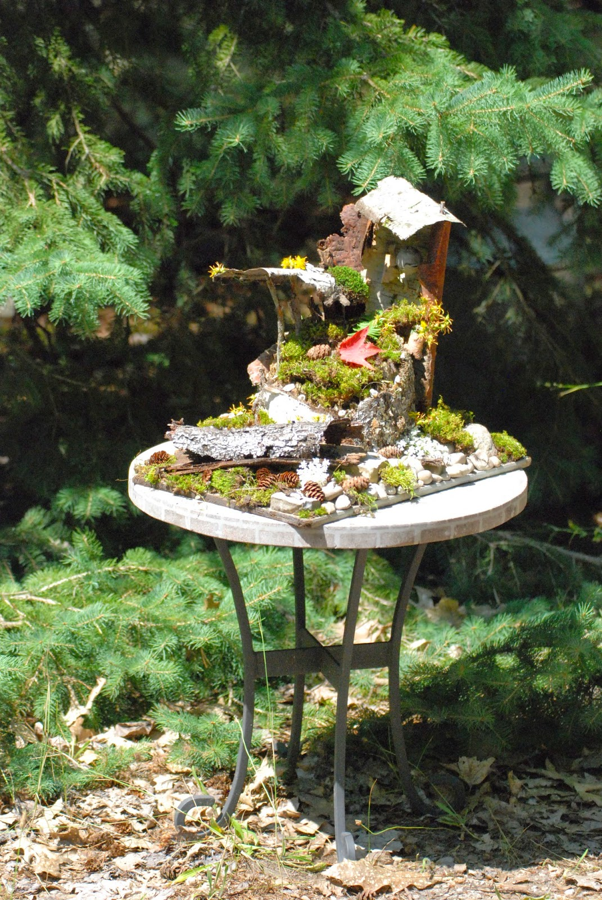
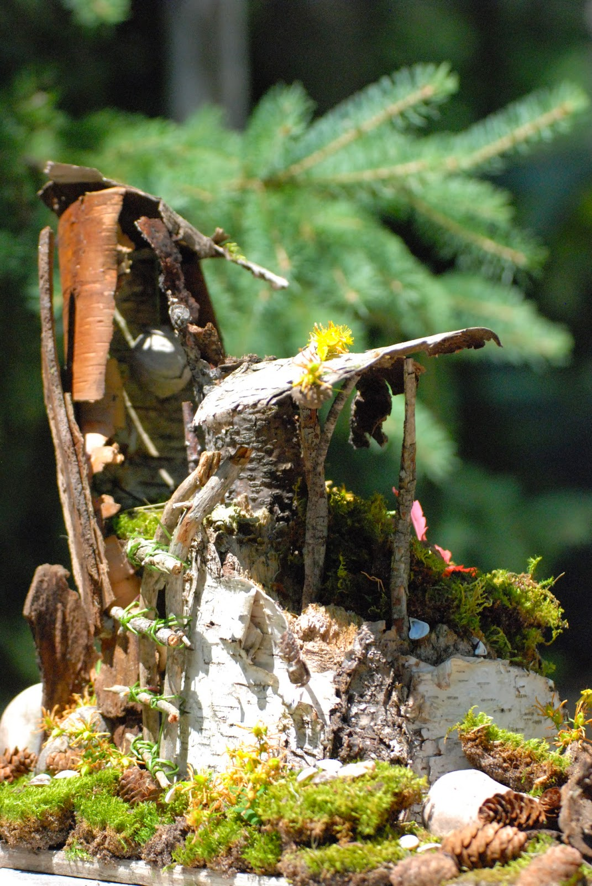
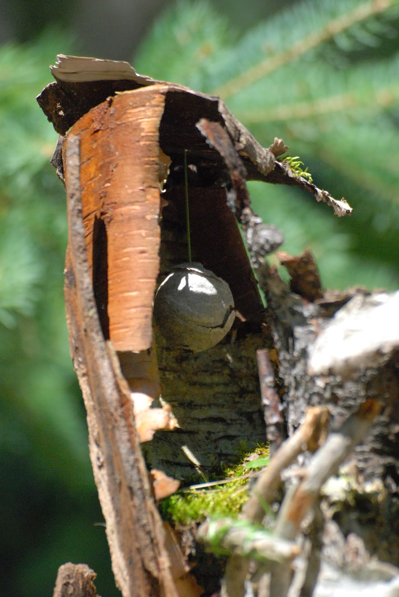

Title: Fairy House
Date: 2014-11-28
Tags: Maker

{ width=200, align=right, hspace=10}

Over the summer we spent some time up at our Aunt and Uncle's cottage.  Kids
were picking up a lot of nature detritus to "keep" and my wife got the idea to
make a Fairy House.  Turned out to be a really fun project.  I particularly
like the paper lantern made from an old hornet's nest and the ladder.  The
trick seems to be start with the big stuff and keep filling in the details
until it looked right.  

\- Dirk

{ width=200, align=right, hspace=10}

{ width=200, align=right, hspace=10}

{ width=200, align=right, hspace=10}

{ width=200, align=right, hspace=10}

Blogpost migrated from [Blogger](https://apprenticemaker.blogspot.com/2014/11/fairy-house.html) using custom python script. Comment on errors below.
