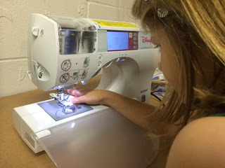
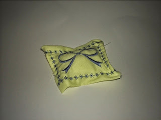
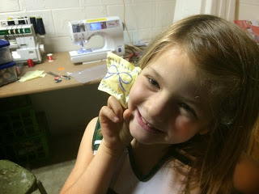

Title: Learning to use a sewing and embroidering machine
Date: 2014-11-28
Tags: Maker

{ width=200, align=right, hspace=10}

We are trying to turn our basement into a mini makerspace for the kids.  Quite
a few years ago my wife bought a fancy sewing machine that does embroidery
which I thought would make a fun addition.  My eldest daughter and I got
playing with the machine and it is quite amazing.  In no time at all we were
able to embroider a bow and make a cute little pillow.  I look forward to
seeing what we will make next time.

\- Dirk

{ width=200, align=right, hspace=10}

{ width=200, align=right, hspace=10}

Blogpost migrated from [Blogger](https://apprenticemaker.blogspot.com/2014/11/learning-to-use-sewing-and-embroidering.html) using custom python script. Comment on errors below.
