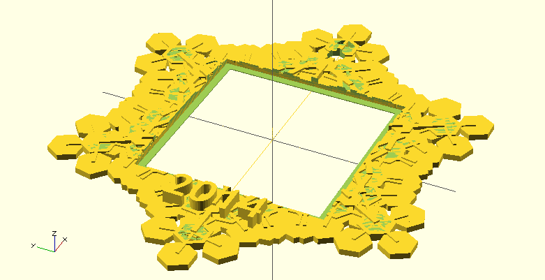
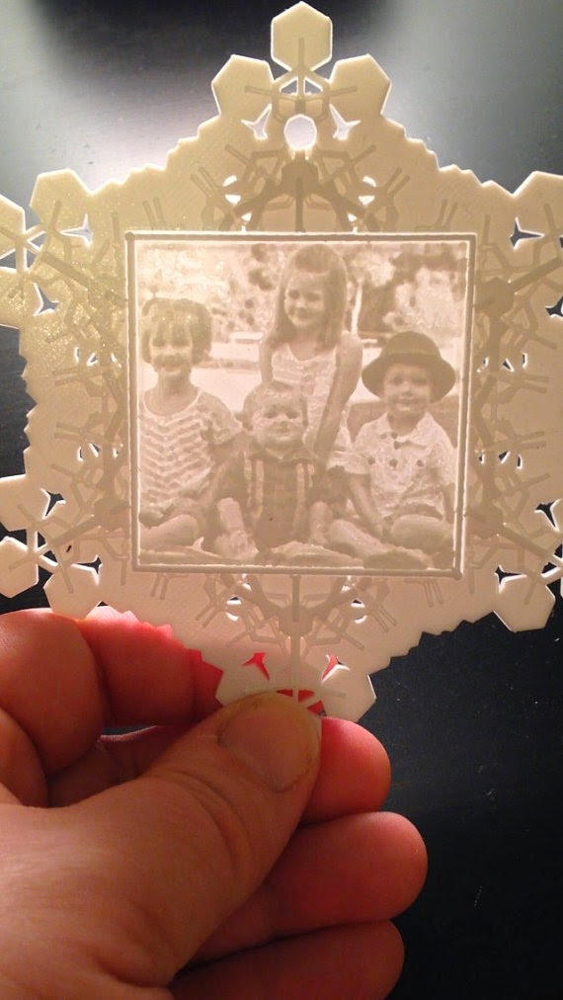

Title: Snowflake Lithophane
Date: 2014-11-28
Tags: Maker, 3DPrinting

{ width=200, align=right, hspace=10}

There is something magical about looking at a lithophane.  I like handing them
to people with the light coming from the front.  Most of the time they are
polite and say, "that's nice."  Then I have them hold the lithophane to let
the light come in from the back and the image pops out.  "Wow," "cool" they
say and the expressions on their faces are ones of awe and surprise.  

For Christmas this year, my wife came up with the idea of putting a picture of
the kids inside of a lithophane inside of a 3D printed snowflake.  

{ width=200, align=right, hspace=10}

Took a while to figure out but got much easier when I found an openscad
program to generate snowflakes I found on Thingiverse:  

<http://www.thingiverse.com/thing:74322>  

I picked a random seed that fit well with my idea and then I tried importing
my the stl file from my lithophane program.  I could not quite git it to work.
So, instead I decided to make the print in two parts and glue them together. I
did some minor modifications to the openscad file add an area for the
lithophane, the hole for a ribbon and in latter modifications a way to add the
year.

You can download the stl file for the frame on youmagine:

<https://www.youmagine.com/designs/snowflake-ornament-frame>

Now I just print the lithophane separate from the frame and it turns out quite
well.  Here is a video:

I am happy to share any of the code or you can just upload a photo and order
one of these on our etsy store:  

<https://www.etsy.com/shop/familyheART>  

I wife has challenged me to do something similar with a heart for valentines
day.  That should be fun.  

\- Dirk  

Blogpost migrated from [Blogger](https://apprenticemaker.blogspot.com/2014/11/snowflake-lithophane.html) using custom python script. Comment on errors below.
