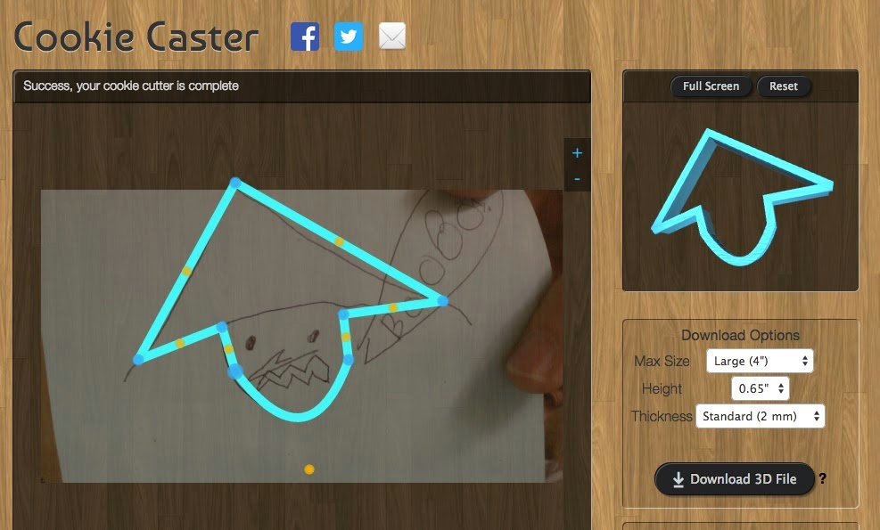

Title: 3D Cookie Cutter app comparison
Date: 2014-12-25
Tags: Maker, 3DPrinting

My oldest daughter is in her second year of Brownies.  My wife and I
volunteered to lead a couple of their meetings with a maker theme.  I thought
the 3D printer is always a hit and what better project for girl scouts than
cookies (yes I realize this is cliche but it is still fun).  I did some
searching on the internet and came up with a variety of ways the girl scouts
could design cookie cutters.  However, I had a checklist of desires and none
of them quite made the "cut" (I will stop now).  Here is what I was looking
for:  

  1. An option to upload and trace a picture. This is necessary because I do not have enough computers for the group. I saw a similar activity at the Detroit Maker Faire and I thought hand drawn images would be more natural.
  2. Ability to add both internal and external features on the cookies. What I would really like is two layers so the cutters could imprint on the cookie as well as cut through the cookie.
  3. Ideally an online app so I do not have to download anything.  
  4. Obviously an easy way to output stl files I could use with my printer.

 **CookieCaster:**<http://www.cookiecaster.com/#editor>  
Online app for drawing outline of cookie cutters.  This makes for a fun group
project because you can scan and upload hand drawings into the editor and
trace them.  The downside is that this editor only does a cookie outline and
not the insides. Here is an example we did:  

{ width=200, align=right, hspace=10}

 **Cookie Cutter Editor:** <http://www.local-guru.net/blog/pages/cookiecutter-editor>  
Downloadable cookie cutter editor. Uses a programming language called
processing (written in java).  I could not get the MacOS stand alone version
to work so I tried to download processing and run the source directly.  Still
was missing some libraries so I gave up on it.  Looking at the examples I do
not think it would work much better than CookieCaster and could not get any of
the internal details I wanted anyway.  

**Thingiverse:**

  

Thingiverse has one of their customizable apps.  This one was really nice
because it could do some internal details. Seems to only have one height but
having details is better than the other two.  However, this app also only had
an option for online editing and no way to upload a picture.  It was also a
difficult interface to master.  For example, it does not handle overlapping
editing very well and was particularly hard to get right with my laptop's
touchpad.  Here is an examples we made:  

<http://www.thingiverse.com/apps/customizer/run?thing_id=116042>  

Although none of the apps seem like they would work, none of them really fit
all of my criteria.  I am going to have the girl scouts use Cookie Caster
since it is the one that works with pictures. Please stay tuned for future
blog posts with details highlights from the girl scout projects.  

\- Dirk

Blogpost migrated from [Blogger](https://apprenticemaker.blogspot.com/2014/12/3d-cookie-cutter-app-comparison.html) using custom python script. Comment on errors below.
