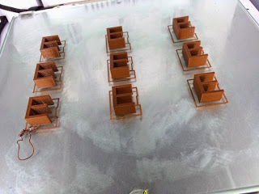
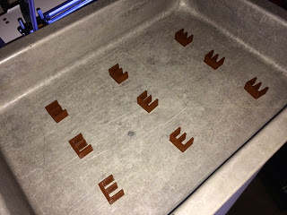
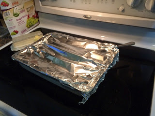

Title: April 1st Brownies
Date: 2015-04-03
Tags: Maker, 3DPrinting

An oldie but a goodie with a modern twist. This year I printed out the letter
E on my 3D printer using Brown PLA plastic.  

Then I put the Brown E's in a baking pan:

Cover with aluminum foil and tell the kids I made brownies for them.

The were a little disappointed but then quickly got into the spirit of the day
and played the same joke on their mom and nanny.  I even took some "sugar
free" brownies into the dentist with me and gave some to my brother and his
house mates.    

Happy April fools day.

\- Dirk

Blogpost migrated from [Blogger](https://apprenticemaker.blogspot.com/2015/04/april-1st-brownies.html) using custom python script. Comment on errors below.
