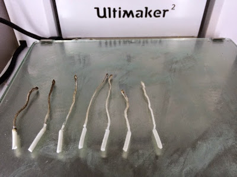

Title: Ultimaker 2, cleaning a clogged nozzle
Date: 2015-05-02
Tags: Maker, 3DPrinting

So my Ultimaker2 extruding head got clogged, really bad.  Something got jammed
while printing and I could not get the filament to feed.  This had happened
once in the past when I tried using some really cheap filament but I am not
sure the real root of the problem this time.  In any case, I found using the
"atomic" method for getting a clean nozzle. This method is named after
MostlyAtomicBob who described the method for the first time in the following
post:

http://umforum.ultimaker.com/index.php?/topic/3561-ultimaker-2-extruder-nozzle-blocked/#entry28940

Here is a summary of the steps that I used:

1) Remove the boden tube from the printer head

2) Heat up the head to full temperature (around 210 degrees)

3) Push in a piece of spare filament until I can no longer push or it starts
coming out the end.

4) Reduce temperature to around 90 degrees. Filament should solidify but stay
a little soft.

5) Pull the filament out of the print head.

6) Repeat steps 2-5 until I get completely clean filament

You can see the result of my cleaning in the picture below. The pieces are a
little backward and ordered from right to left.  Note the really dark char
slowly going away and the pieces getting longer as they nest better and better
in the print head.

Here is the same procedure when it clogged a second time. This time I
remembered to order them from left to right.  

\- Dirk

Blogpost migrated from [Blogger](https://apprenticemaker.blogspot.com/2014/12/ultimaker-2-cleaning-clogged-nozzle.html) using costom python script. Comment on errors below.
