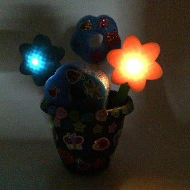
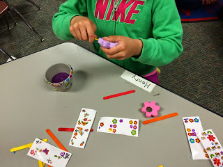
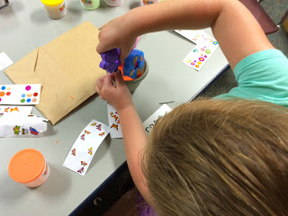
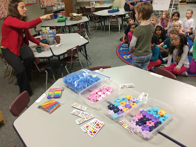

Title: Intrducing a 3D printer to my daughter's Kindergarten class
Date: 2015-05-09
Tags: Maker, 3DPrinting

We had fun showing off my 3D printer to the Kindergarten class.  Although the
printer is fun to watch, kids tend to get board with it in just a few minutes.
I like to come up with classroom projects that let the kids use things that
are printed with the printer. Since it is so cheep it is also fun to print
something ahead of time that they can take home.  

For the kindergarten class we printed some flowers that the kids could use to
put together a cut spring  time flower pots just in time for mother's day:  

It even lights up:

The kids had a great time. Here are some pictures  

Turned out to be a lot of fun.  If you are interested in making your own here is a list of instructions on Instructables:

<http://www.instructables.com/id/Spring-kindergarten-Class-Project-with-3D-Printer/>  

And the 3D files on YouMagine:

<https://www.youmagine.com/designs/light-up-flower>

Blogpost migrated from [Blogger](https://apprenticemaker.blogspot.com/2015/05/showing-off-3d-printer-to-daughters.html) using custom python script. Comment on errors below.
