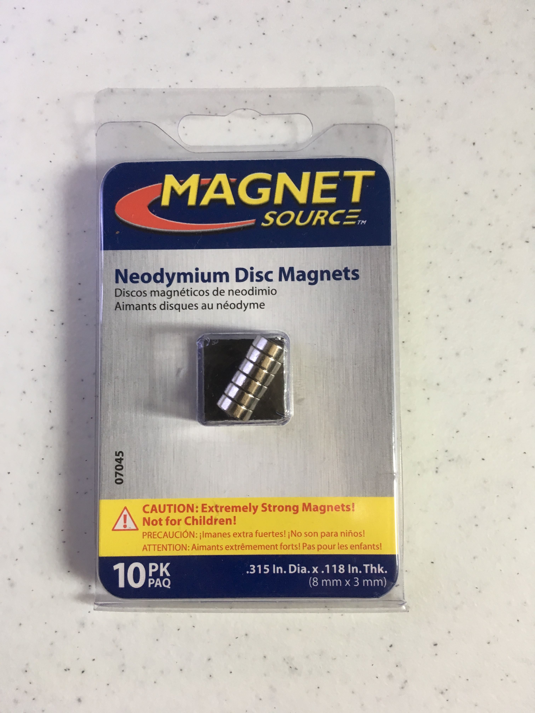

Title: 3D printed Switch Guard
Date: 2018-08-15
Tags: Maker, 3DPrinting

{ width=25%, align=right, hspace=10}

We recently moved into a new house and the kids are having fun running around turning on and off all the lights. Unfortunately, some of the light switches are not for lights. One goes to our garbage disposal, another goes to the gas fireplace and another turns off the furnace.  I decided I wanted to design a 3D printed magnetic light switch cover that would connect to the standard bolts that hold on a light switch cover plate.  The cover would discourage inadvertent switching of the lights but also easily allow us to use the switch when we need too.

As with many of my projects I guessed I was not the first to have this Idea so I searched existing designs on [Thingaverse.com](https://www.thingiverse.com/) and [Youmagine.com/](https://www.youmagine.com/).  Although I could not find designs that used magenets, there were a number of interesting options that used the same screw holes.  The one I thought looked the best was by [jwolle1](https://www.thingiverse.com/jwolle1/about):

{ width=25%, align=right, hspace=10}

So I started with this design and wrote a simple [OpenSCAD](http://www.openscad.org/) program to load in the design as a starting point and then modify it to add holes where I could add some standard magnets i got from Home Depot.  

{ width=25%, align=right, hspace=10}

The final product turned out great.  I ended up printing three of them for myself and one for my brother.  Here are some pictures:

{ width=25%, align=right, hspace=10}

{ width=25%, align=right, hspace=10}
