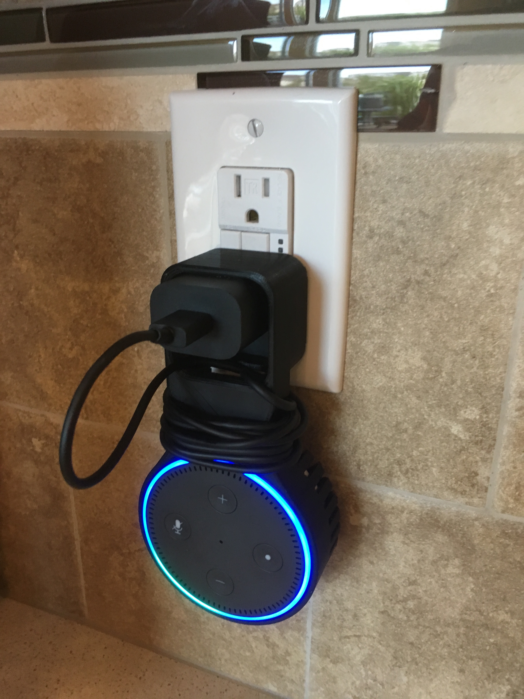

Title: Alexa Dot Holder
Date: 2018-09-16
Tags: Maker, 3DPrinting

{ width=200, align=right, hspace=10}

My brother got me an Alexa Dot for Christmas a few years ago.  It turns out to be a lot of fun. We put it in the kitchen and the kids play music.  My wife and I also use it to add things to our shopping list (very convenient!) Anyway, I like to explore [Thingaverse.com](https://www.thingiverse.com/) by tying in the names of gadgets I have to see what kinds of modifications you can find.  When I typed in Alexa dot I came across this really cool plug holder which would get it off my kitchen counter.  

[https://www.thingiverse.com/thing:2300667](https://www.thingiverse.com/thing:2300667)

The design is by [Cpt Skippy](https://www.thingiverse.com/cptskippy/designs) and I am really pleased with how it turned out.  

I may post a new picture when I get a smaller USB cable that doesn't need to wrap around so much.
