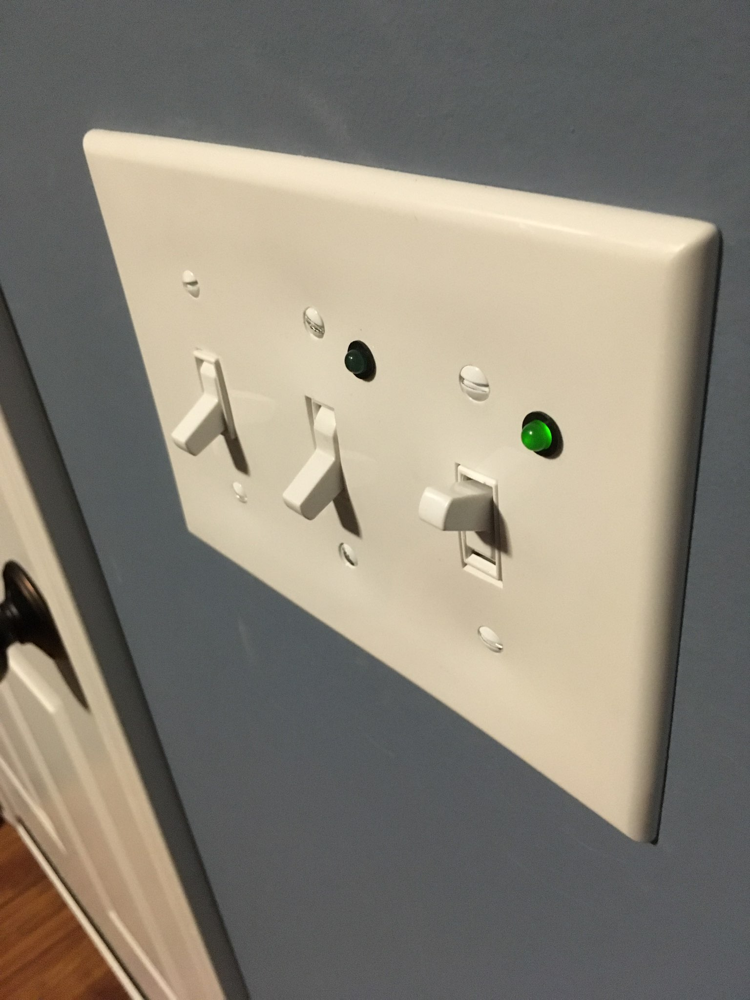
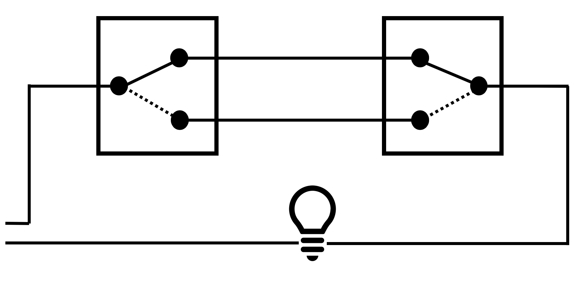
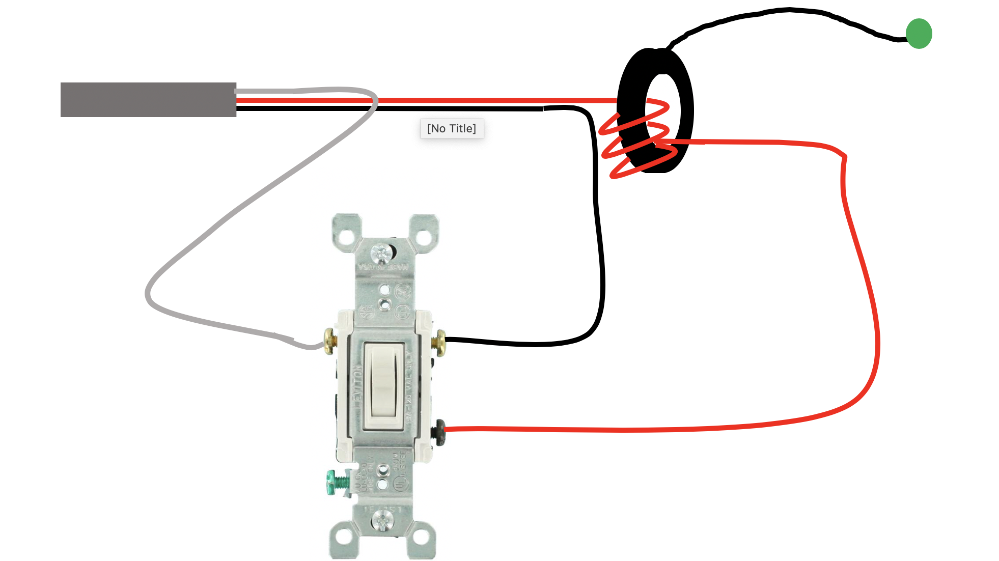
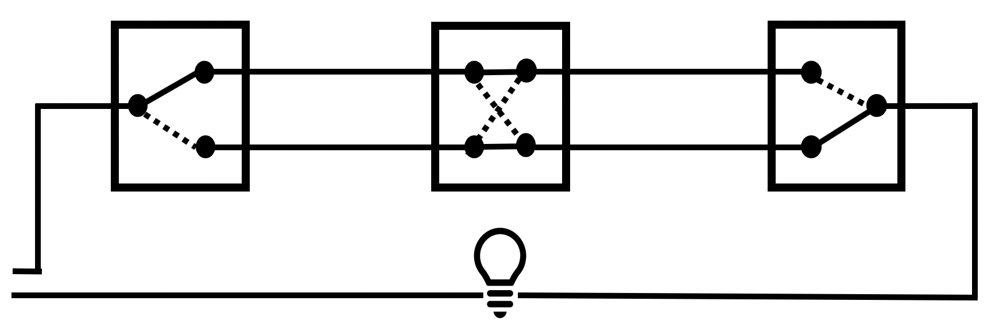
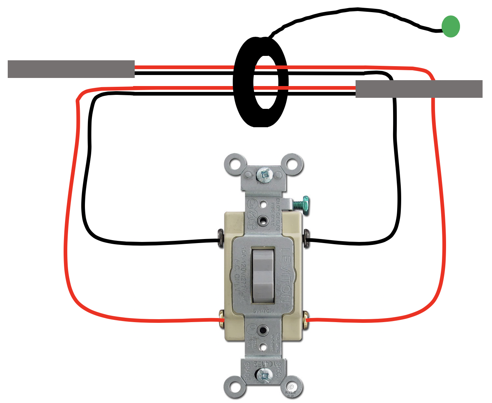

Title: Three and Four way switch status lights
Date: 2019-01-01
Tags: Home

{ width=200, align=right, hspace=10}

There are two light switches in our mudroom that control the garage lights and the lights on the front of the house.  Unfortunately I can not see these lights when standing next to the switches and sense there are multiple switches for each light you can not know if the lights are actually on or off.  I decided to install an indicator light next to the switch to tell if the lights are on or off.  

I did some web searching and there are some three way switches with "pilot" or indicator lights. However, most of these are lit when the switch is off and I wanted them to be lit when on.  I also didn't really like the look of most of them.

### Attempt 1 - 120v LEDs (Spoiler, this Didn't work)
I found some really cool [120V LEDs on Amazon](https://www.amazon.com/dp/B000K2IKPK/ref=cm_sw_em_r_mt_dp_U_DU5kCbE2CCCXM). My thought was to wire one in series with my lights.  However, once I got them and tried them out the LEDs worked fine but the outside lights didn't work at all.  I slapped my head realizing that the "D" in LED stands for "diode" and I was chopping off the A/C signal.  

{ width=10%, align=right, hspace=10}

### Attempt 2 - two 120v LEDs (This didn't work either)
The obvious solution (to me) was to just use two of the 120V LEDs with going in opposite directions this way current would always be able to flow though them.  That didn't work either. Not exactly sure why... my best guess is that the LEDs dropped the current or voltage in such a way that the outside lights no longer could work.  To be honest I didn't spend much time debugging the problem because I came up with another solution...

### Attempt 3 - Remote Current Indicator (This one worked nicely)

For my third attempt I found some [Low Cost Remote Current Indicators](https://www.amazon.com/dp/B005CWHD42/ref=cm_sw_em_r_mt_dp_U_h15kCbGJ8DPMQ).  

What is nice about these is that they get their power though induction instead of directly being wired in.  The only trick was to ensure that enough current is going through them to get the attached LEDs to work.  Fortunately wrapping the wires around the doughnut increases the current.  

The trick was to figure out how to get them to work properly with three way and four way switches.  The three way solution is fairly strait-forward, all you need to do is wrap the wire going to the light fixture around a few times and the indicator turns on anytime the light turns on. Here are a few diagrams I quickly made to show you how it works.

{ width=25%, align=right, hspace=10}
{ width=25%, align=right, hspace=10}

I didn't realize until I had it all apart the third time that the garage ligth is a four way switch and not just a three way switch. This caused some head scratching since I could not know for sure which wires would be hot. The solution was to pass all the wires though as shown in the following figure.  This only gave me one "loop" but that proved to be enough to get the LED to light up.

{ width=25%, align=right, hspace=10}
{ width=25%, align=right, hspace=10}

Anyways, fun little project and now I can tell if my lights are on.
!
