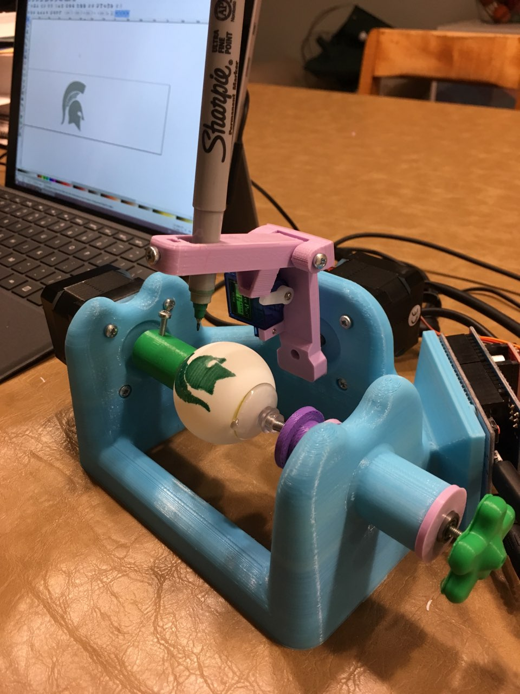
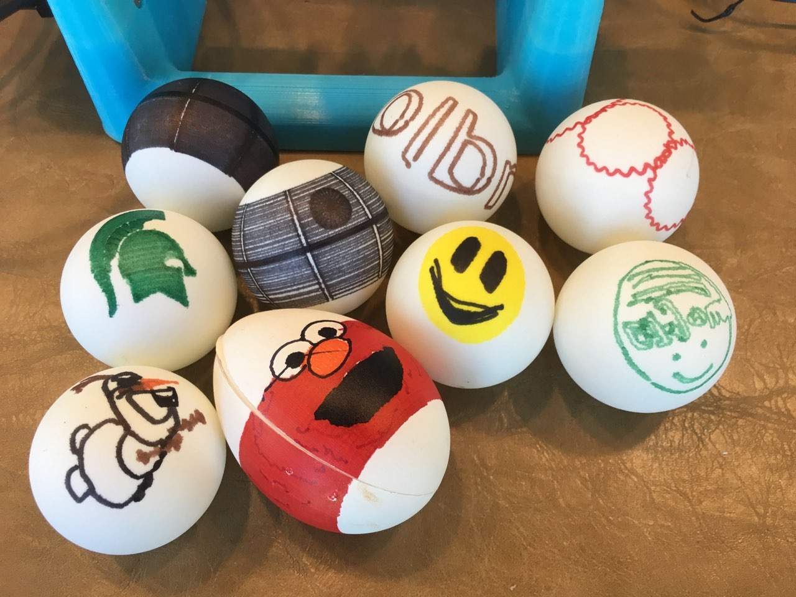
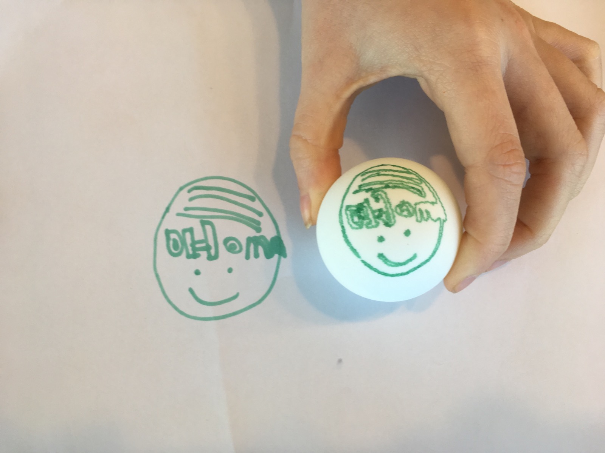

Title: Sphere-O-Bot (JJRobots version)
Date: 2019-04-13
Tags: Maker, 3DPrinting, JJRobots

{ width=200, align=right, hspace=10}

So, the Sphere-O-Bot was my first (and so far only) [JJRobots](https://www.jjrobots.com/sphere-o-bot-jjrobots-version/) project a few years ago (when I didn't have a blog).  My 3D printer was not in the best shape but I was able to get everything assembled and working.

I dug out the Sphere-O-bot this week and after some trial and error I got it back up and running just in time for the Easter Holiday. One of the tricky parts was getting the software to work on an old windows 8 surface we had laying around. The software has three components:

1. [Arduino Leonardo Arduino drivers](https://www.arduino.cc/en/Main/Software)
2. [Inkscape Version 0.91](https://inkscape.org/release/0.91/) - Newer versions of Inkscape do not work.
3. [Eggbot Extention for Inkscape](https://wiki.evilmadscientist.com/Installing_software)

Running the installers for the above is just the first step.  I had a heck of a time getting the software to connect to the Arduino. It took a lot of googling and multiple problems on top of each other which made it tricky.  One key thing I had to change was the following line in the
```eggbot_scanwin32.py``` file:

```hKey = _winreg.OpenKey( hReg, r"SYSTEM\CurrentControlSet\Enum\USB\VID_2341&PID_0043" )```

Turns out the VID and PID are unique to my system.  You can figure these numbers out by using the Arduino software and looking at the board specifications or you can look them up in the device manager.  Kind of tricky.  

Anyway, once we got it working it turns out to be extremely fun. I purchased a bunch of ping-pong balls online:

[STIGA 2-Star White No Print Table Tennis Balls (144-Count) by Amazon.com](https://www.amazon.com/dp/B001QVA5A2/ref=cm_sw_em_r_mt_dp_U_OIFSCbTPRMWYN)

These are reasonably priced and work well for printing.  We have already gone though and printed a bunch of designs we download from the internet.  

{ width=200, align=right, hspace=10}

I also had my daughter draw a picture and put it on an egg:

{ width=200, align=right, hspace=10}

There are many steps to getting this to work but they are all fairly easy:

1. Draw a picture with only one color (to start) on white paper.
2. Open up the eggbot svg Inkscape template file from the examples directory.
3. Take a picture with my phone and email it to me.
4. Upload the picture into Inkscape.
5. Run the trace bitmap function in the menu.  This will take some fiddling to get only the parts of the image you want.
6. Edit the resulting vectors as needed.
7. Highlight the entire bitmap such that all of the points are selected.
8. Run the object to path function in the menu.
9. Run the Eggbot Extension and print as normal.  

The above instructions are really just notes for myself the next time I want to do this activity with the kids.  If anyone besides me is reading this blog, please feel free to put a comment below or drop me an email and I am happy to put together more detailed instructions for installation and/or printing a picture.
