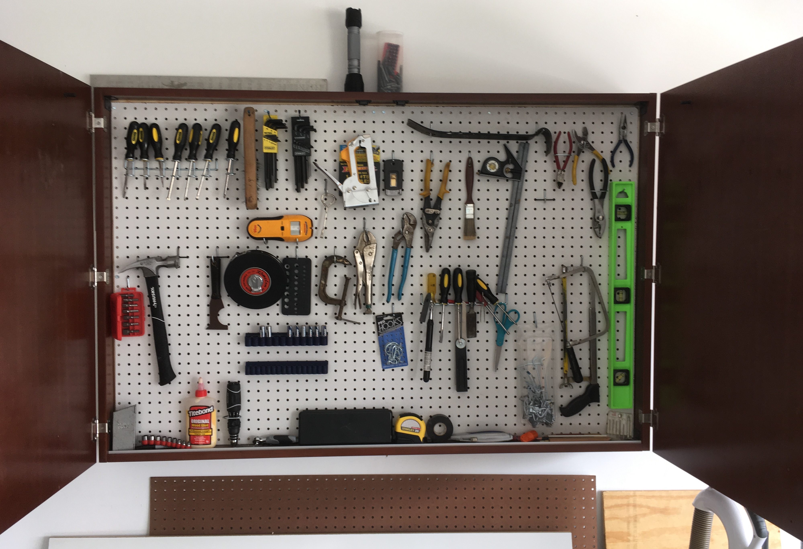
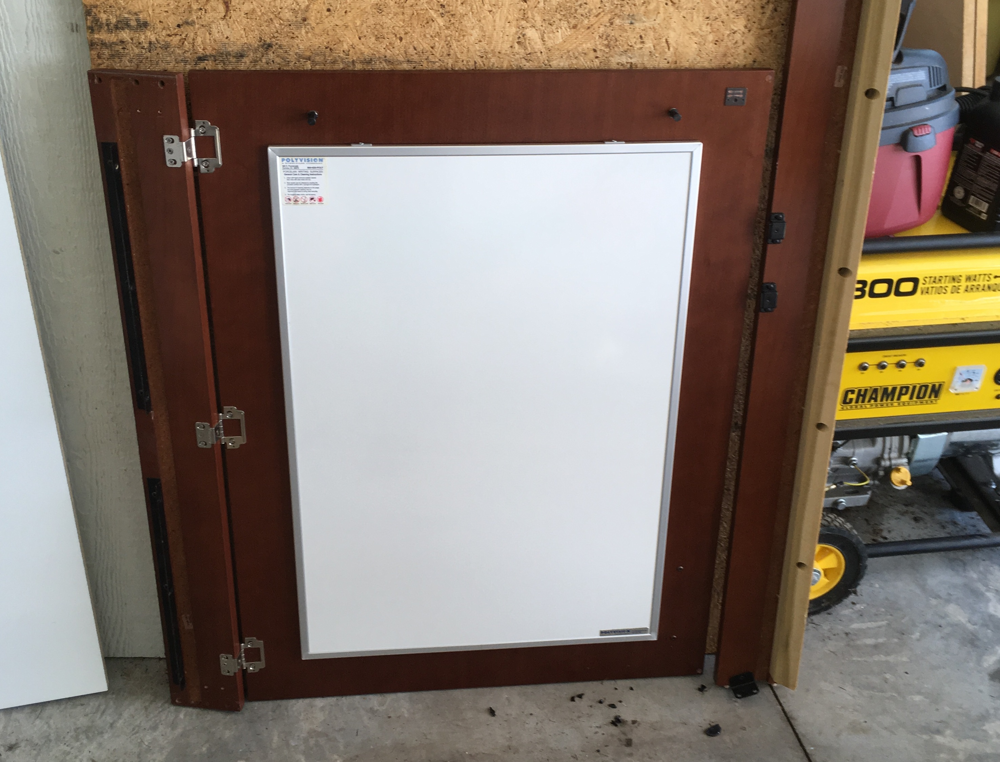

Title: Surplus Tool Cabinet 
Date: 2019-07-09
Tags: Maker

I found this really durable whiteboard conference room cabinet at the [MSU surplus store](https://msusurplusstore.com/) and converted it to a tool cabinet.  

The original cabinet had 3/4" whiteboard panels in the back and additional panels on the inside of each door:

These things were really heavy! I removed all of the whiteboards and added a pegboard.  I added this to the wall of my garage next too my car.  It looks great and fits nicely.  