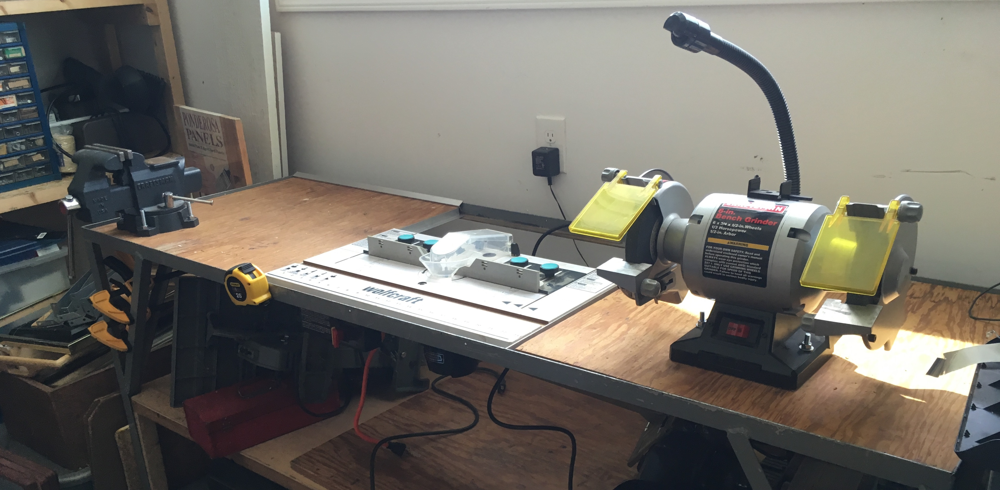
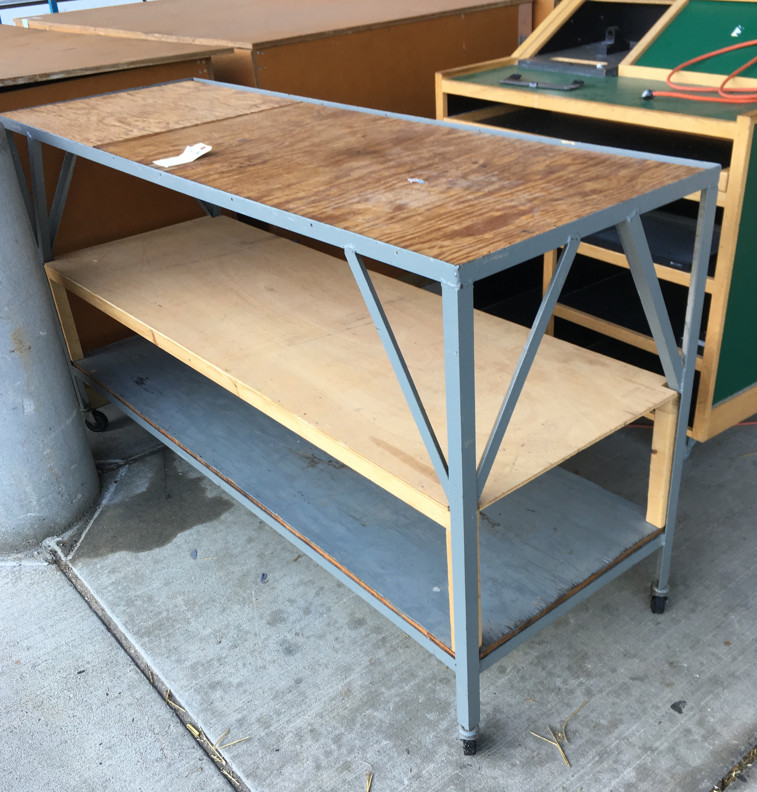

Title: Surplus Workbench 
Date: 2019-10-04
Tags: Maker

Since moving into our new home I have been wanting to build/buy a workbench for my shop.  I have been living with a piece of plywood on some saw horses (bowing in the middle).  I wanted something more rugged but on casters so I could roll the bench out into my main garage when I needed space or if I wanted to clean up.  I also really liked the idea of having a workbench where I could swap out tools mounted to 2x2' boards.  The idea is the tools could be stored in a shelf and then the 2x2' boards could easily be set into the bench when needed.  It was mostly an idea in the back of my head but I was having fun doodling designs.  

I was passing though the [MSU surplus store](https://msusurplusstore.com/) and came across the perfect bench. Actually I had been looking though the store specifically for something I could use as a workbench and/or something with parts I could up-cycle into a workbench (like casters) but I was on my way out the door disappointed.  As I was leaving someone else was pushing a workbench out the door that looked exactly like what I wanted. I was kicking myself that I missed the bench and, as I walked to my car,  I longingly looked over my solder to watch, whomever beat me to the bench, put it in their car.  However, I realized that the person with the bench was not a customer but actually someone putting it outside on the store curb with other items for sale. I quickly grabbed the bench and brought it home.

The main working space is 6' x 2' so I cut it into 3 square 2x2' boards.  I can now swap out any of the boards and the modular workspace is really nice. So far I have my router, my grinder and my vice mounted to 2x2' boards I can easily swap out. 

It fits really nice in my tiny workshop and having a great bench has been a wonderful catalyst for me working in my shop on a variety of projects.  