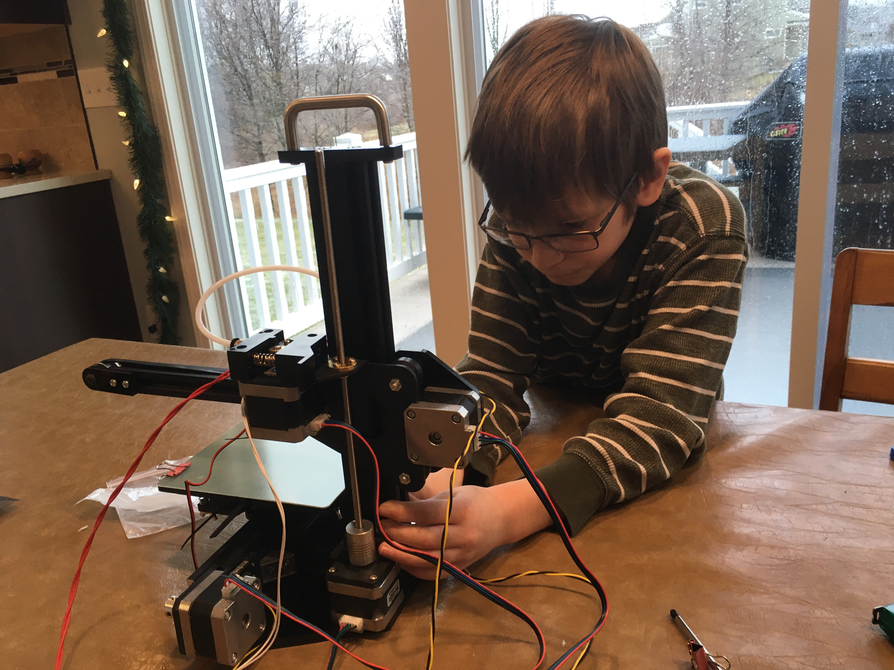

Title: Tronxy X1
Date: 2020-01-11
Tags: Maker, 3DPrinting

My "baby" brother is a new professor and designing an additive manufacturing course for his students.  He found a fairly affordable (price of a typical textbook) 3D printer kit called a [Tronxy X1](https://www.tronxy.com/x-series/tronxy-x1.html) for his students to put together and take home.  

To get ready, he and I purchased our own printers and we put them together this weekend with all of the kids.  This is a really great kit.  The printer has tons of amazing features for something so affordable:

- Interactive screen and SD card reader design that doesn't require an attached computer while it is printing
- The controller board is obviously designed for a more advanced printer and allows for upgrades like additional fans and a heated printer bed
- Did I mention this is affordable (~$90)

The build took us about 6 hours from unboxing to cleanup (after printing).  It was a great way to pass a Saturday.   We had to make a few tweaks to the build but overall I was pleased. Some things included:

- My kit was missing some spacers but I was able to replace them with a couple of extra nuts. I may print out new spacers but so far it is working fine.
- The SD card only came with one simple gcode example. It was not a very impressive piece
- I could not find instructions to set up the slicer.  None of the common ones such as [Slic3r](https://slic3r.org/) or [Cura](https://ultimaker.com/software/ultimaker-cura) seemed to have TronXY X1 set up already.  Turns out this wasn't too bad to fix.

Overall it was a great kit and my Nephew in particular is excited to get on [thingaverise](https://www.thingiverse.com/) to see if he can find models to download, slice and print.

