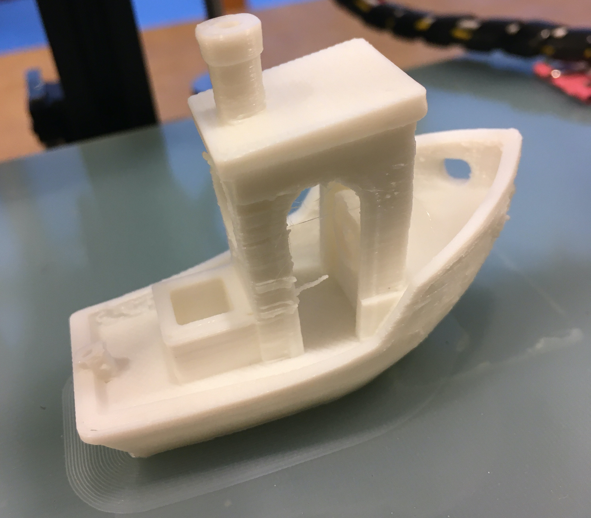
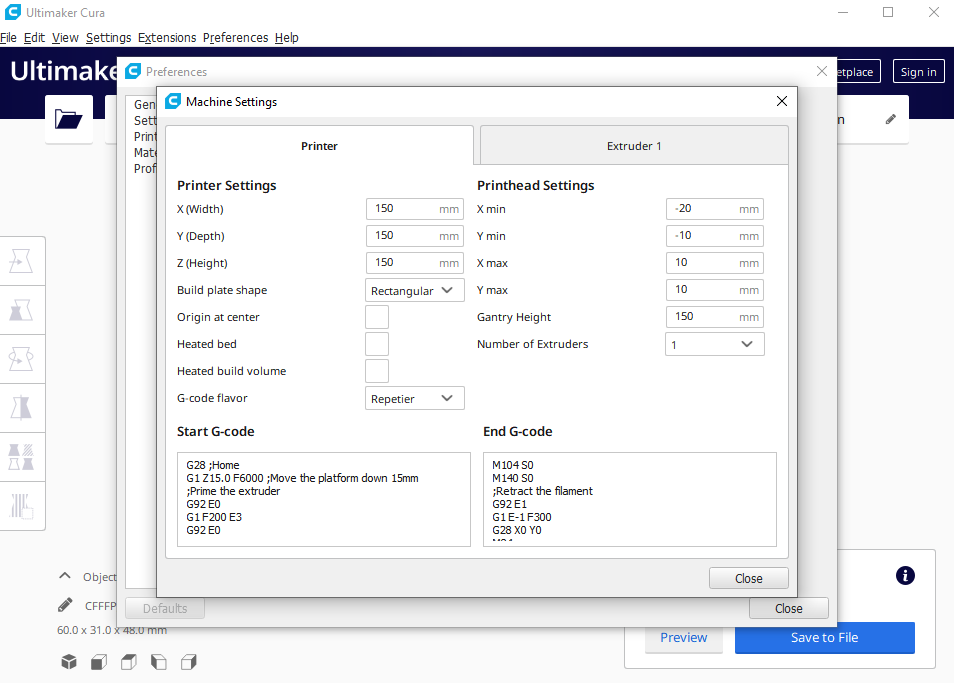
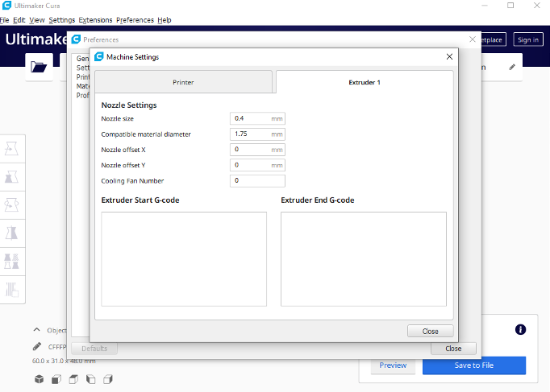

Title: Tronxy X1 Cura Settings
Date: 2020-01-12
Tags: Maker, 3DPrinting

My new [Tronxy X1](https://www.tronxy.com/x-series/tronxy-x1.html) has been a lot of fun to put together.  The tricky part was finding the right setting for the slicer.  Turns out it is not that difficult at all.  I was able to download my favorite OpenSource slicer, [CURA](https://ultimaker.com/software/ultimaker-cura) and needed to type in the specifications from the documentation. Here are some screen shots of my Cura settings:

Everything seems to be working well.  I highly recommend the Tronxy as a great kit to make your first 3D printer.
