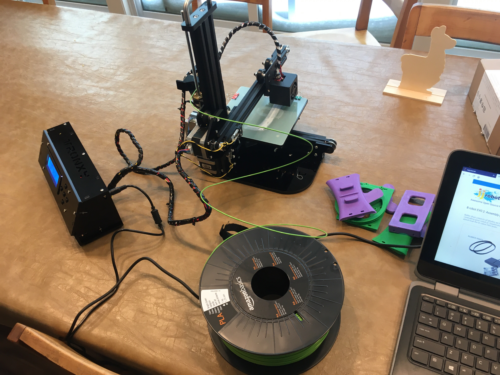

Title: JJRobots B-Robot
Date: 2020-01-18
Tags: Maker, 3DPrinting, JJRobots

A few years ago I purchased a kit from [JJRobots](//www.jjrobots.com/). The kit provides all non-plastic parts and then allows you to build a variety of robots.  Up until now I only made the [eggbot](Sphere-O-Bot (JJRobots version)) which tends to come out around Easter time, the kids love it.

Last week my niblets and children helped me put together a 3D printer.  I used the printer to print the last few parts of the B-Robot.  The bumpers came out backwards but serviceable.  

This week we got together, took apart the eggbot and then assembled the b-robot.  It was a lot of fun, the kids had a great time. To be honest only my nephue really had the pacients to stick it out and complete the robot but it was still a lot of fun.

The one big challenge for me was that the software did not work out of the box. it took me a while to figure out that the version of the kit I had (from a few years ago) was different than the kit currently on the [JJRobots](//www.jjrobots.com/) website.  Fortunately, once I figured out I was working from old hardware, it was fairly easy to search the site and find the old directions.  

With the software installed all the kids had a great time driving it around.  It is fun to see the robot balance on two wheels and the app works great.  

Both projects (eggbot and B-robot) from [JJRobots](//www.jjrobots.com/) were fun to build.  I am looking forward to building the other projects with the kids.