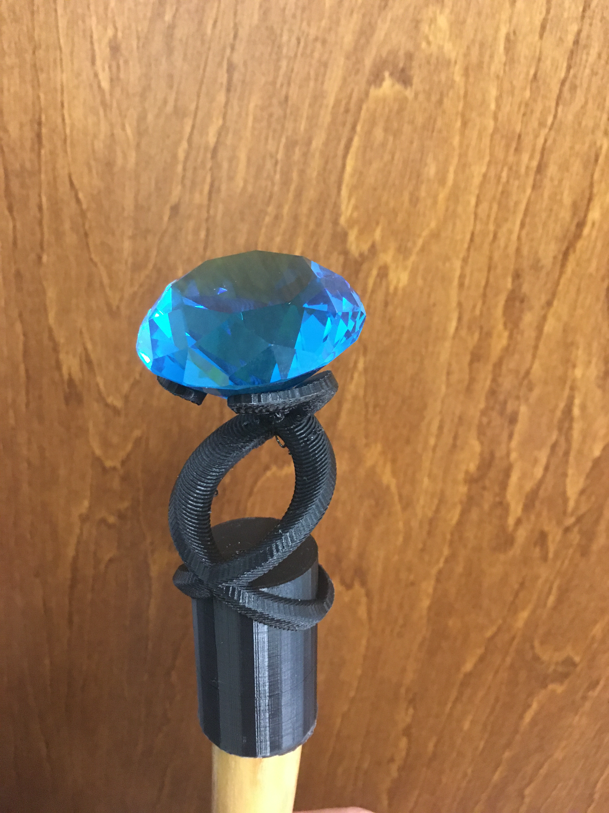

Title: Magical Staff
Date: 2020-03-15
Tags: Maker, 3DPrinting


My eldest is a big Harry Potter Fan and made a few drawings of a Magical Staff they wanted to construct. I was really excited by the drawing. We purchased the crystal and staff online and sat down in front of OpenSCAD and came up with a fairly close design. Here is the OpenSCAD code:

```C++
difference(){
    translate([0,0,-50])  cylinder(h = 50, r =  16, center = true);
    translate([0,0,-103])  cylinder(h = 100, r = 13, center = true);
    translate([0,0,-40]) cylinder(h = 26,r1=13,r2=0, center=true);
}
translate([0,0,-50]) for(z=[0:4:+350]) {
    rotate([0,0,z]) translate([16,0,z/6+10]) rotate([0,-30,0]) cylinder(h=3, r=5);
    rotate([0,0,-z+180]) translate([16,0,z/6+10]) rotate([0,-30,0]) cylinder(h=3, r=5);
}

translate([0,0,-40]) for(z=[-180:6:0]) {
    rotate([0,0,z]) translate([16,0,0]) rotate([0,-30,0]) cylinder(h=3, r=5);
    rotate([0,0,-z+180]) translate([16,0,0]) rotate([0,-30,0]) cylinder(h=3, r=5);
}

translate([0,0,-50]) for(z=[350:6:+420]) {
    rotate([0,0,z]) translate([16,0,350/6+10]) rotate([0,-30,0]) cylinder(h=3, r=5);
    rotate([0,0,-z+180]) translate([16,0,350/6+10]) rotate([0,-30,0]) cylinder(h=3, r=5);
}

```


The print came out well with minimal supports and we were happy with the design.  The final project looked great.



To get everything to stick together we used Surgu Moldable glue.  We were very happy with the final product.


