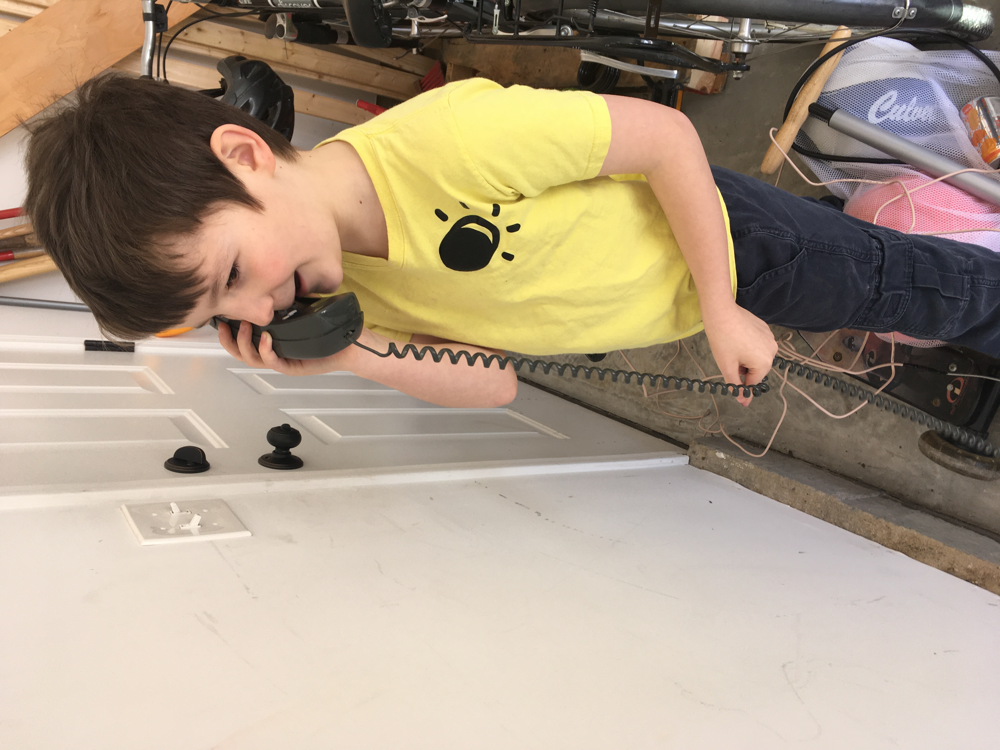
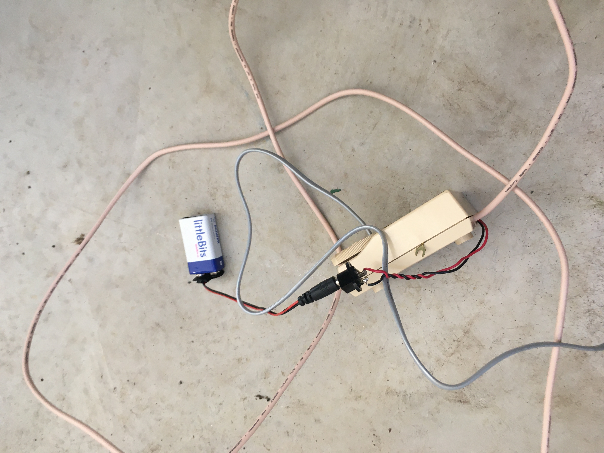
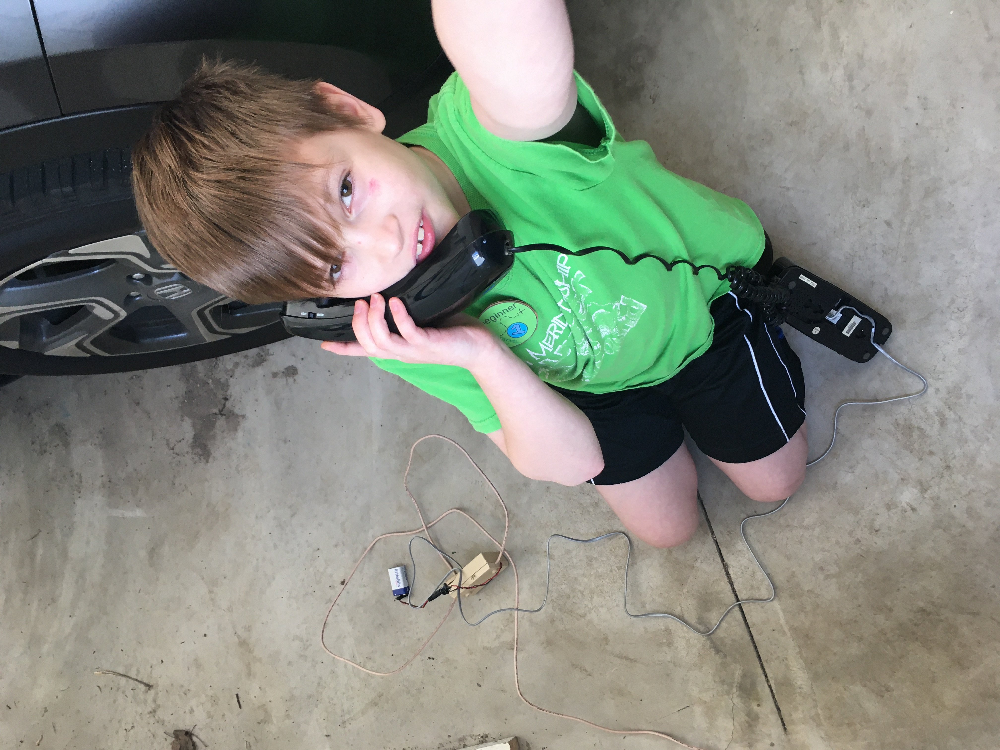

Title: Making a Landline Intercom
Date: 2020-04-19
Tags: Maker

We don't have a landline but over the years I have collected a bunch of phone wiring, sockets, etc.  My spouse asked their social network and we got three landline phones and the kids and I put together a really simple intercom project with a 9 volt battery.  

All we did is put the 9volt in the red wire of the phone and connected them as shown in the diagram.  The kids ran the phone with 25 feet of wire between the houses and were able to hear each other quite clearly from either garage.  

The whole project didn't take more than 30 minutes even with me playing around with the soldering iron (which was probably not needed).

Phone lasted for quite a few days and the kids had a lot of fun.  If we wanted to use this as a permeant setup I may have improved the circut but as a fun proof of concept it turned out great.

