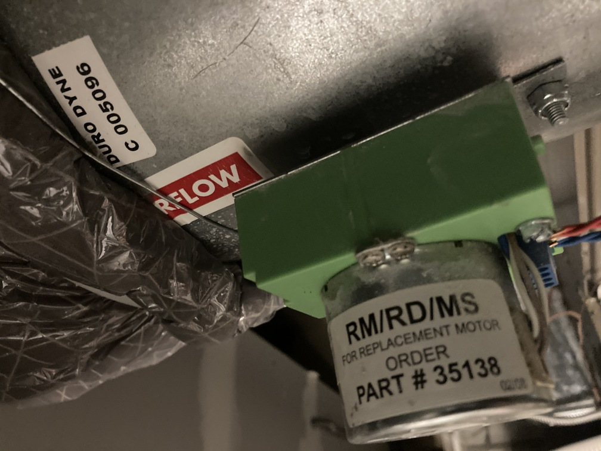
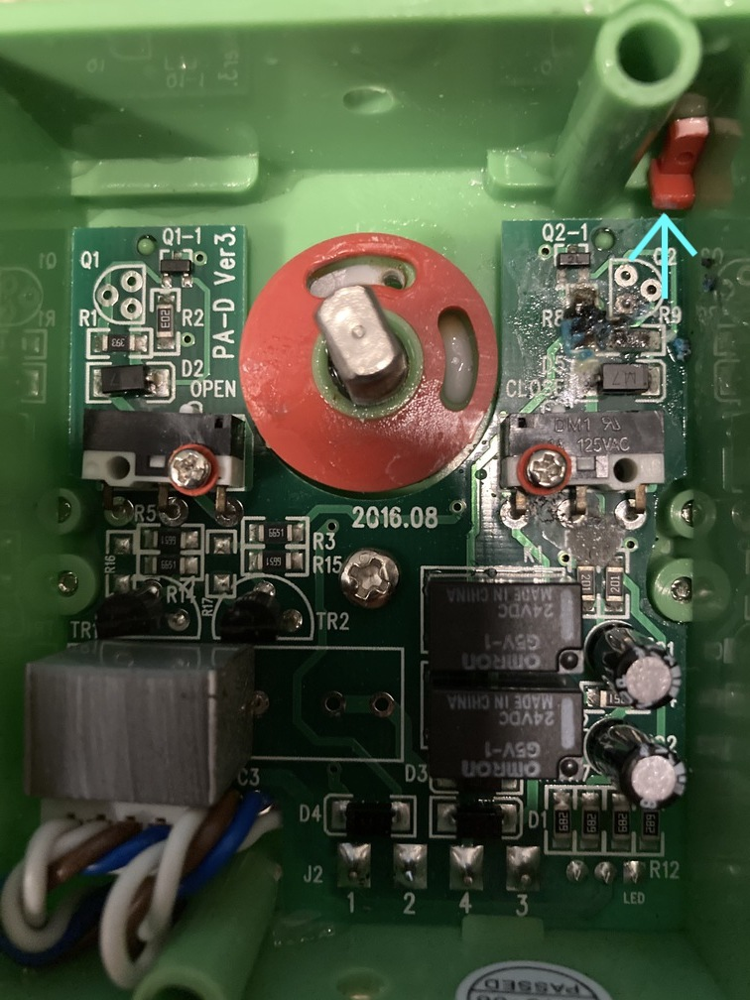
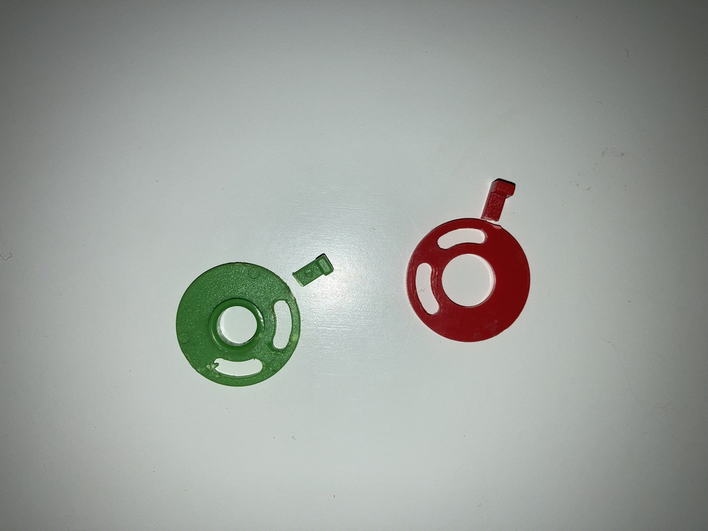
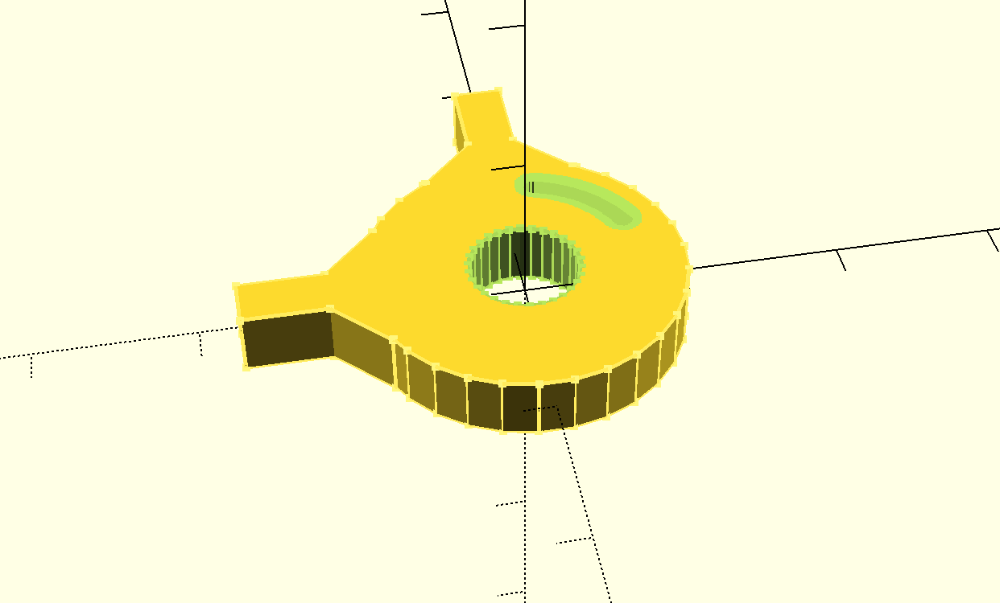
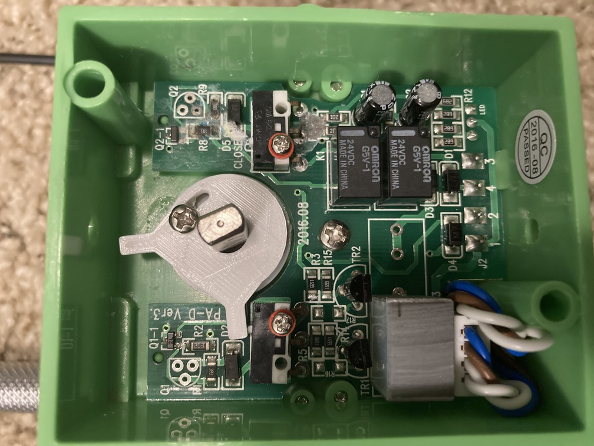

Title: Air Conditioner CAM Replacement
Date: 2020-08-25
Tags: Maker



Our house has a 2-zone heating and air conditioning system.  Today is the third time in the same number of years that one of the automated damper has broken.  The problem seems to be the CAM that triggers the limit switches inside the motor is made of a flimsy plastic and easily breaks (see following pictures).





I decided to build 3D print a stronger CAM.  Instead of trying to replace with two adjustable CAMS my design includes one, thicker CAM which I modeled in OPENSCAD using the following code:


```
  difference() {
      union() {
          translate([0,12.5,0]) cube([3, 10, 4], center=true);
          translate([2,9.5,0]) rotate([0,0,45]) cube([3, 5, 4], center=true);
          translate([-2,9.5,0]) rotate([0,0,-45]) cube([3, 5, 4], center=true);

          rotate ([0,0,90]) union() {
              translate([0,12.5,0]) cube([3, 10, 4], center=true);
              translate([2,9.5,0]) rotate([0,0,45]) cube([3, 5, 4], center=true);
              translate([-2,9.5,0]) rotate([0,0,-45]) cube([3, 5, 4], center=true);
          }
          difference() {
              scale([0.1, 0.1, 1]) cylinder(h = 4, r = 100, center=true);
              scale([0.1, 0.1, 1]) cylinder(h = 5, r = 35, center=true);

          };
      }
      for (a =[15:65]) {
          rotate([0,0,-a]) translate([0,7.5,0]) scale([0.1, 0.1, 1]) cylinder(h = 5, r = 10, center=true);
      }
  }
```

Here is a picture of the final CAM design:



[Link to the generated STL File](../images/AC-Cam.stl)

And here is the CAM put back into the moter housing:



I have included the files in case someone else has the same problem.  The part number for the entire uint is "DURO DYNE C 005096".  Let me know if you find this helpful.
