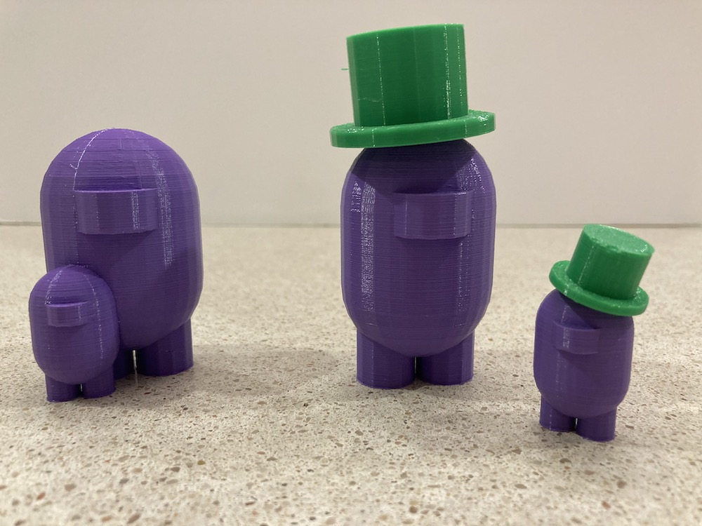
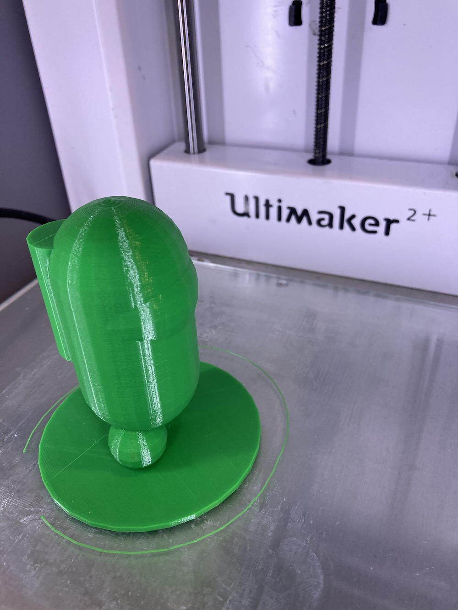

Title: BlocksCAD
Date: 2020-12-11
Tags: Maker

I am a big fan of [OpenSCAD](http://www.openscad.org/), it is my goto tool for making 3D designs.  My kids have been getting into block coding like scratch and I thought, "wouldn't it be cool if there was a block code program that used OpenSCAD?" A quick google search showed me exactly that:

It is a really great interface. I showed my two youngest and then challenged them to make an AmongUs figure (They are really into the game and the shapes are really interesting).  In less than a few hours (with almost no help) they cam eup with some really amazing designs. You can output the designs as stl files or scad files. Very cool!

