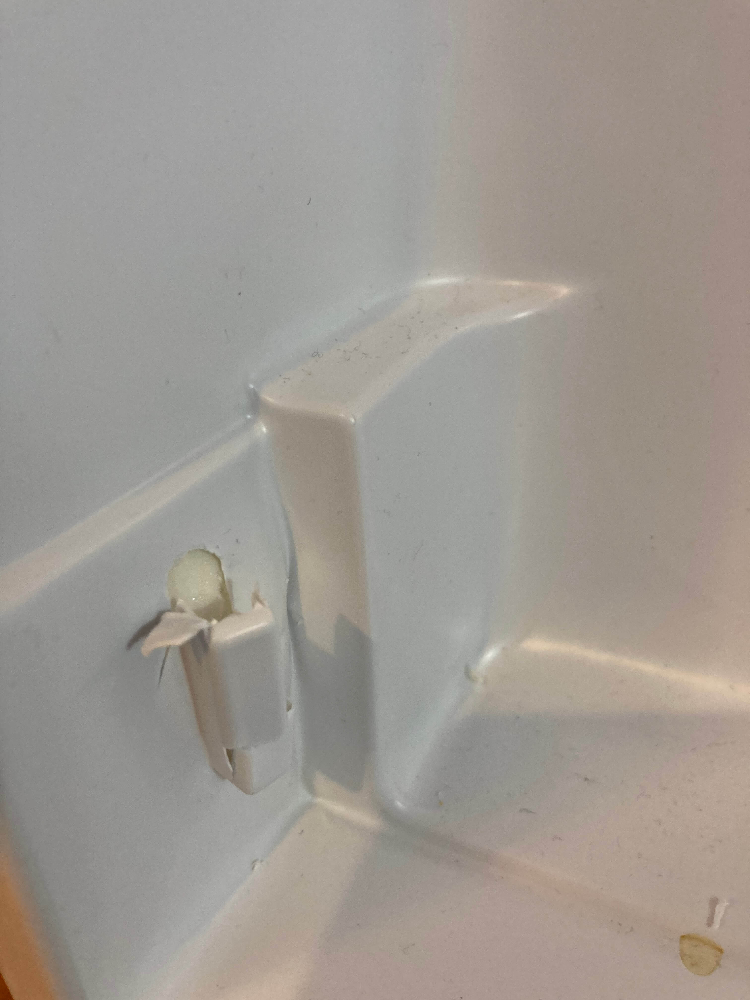
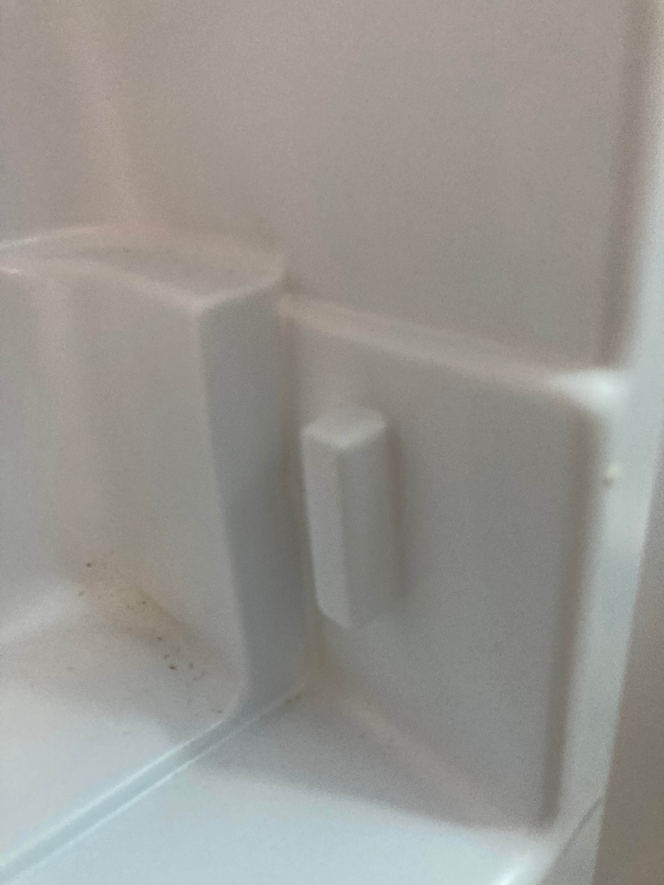
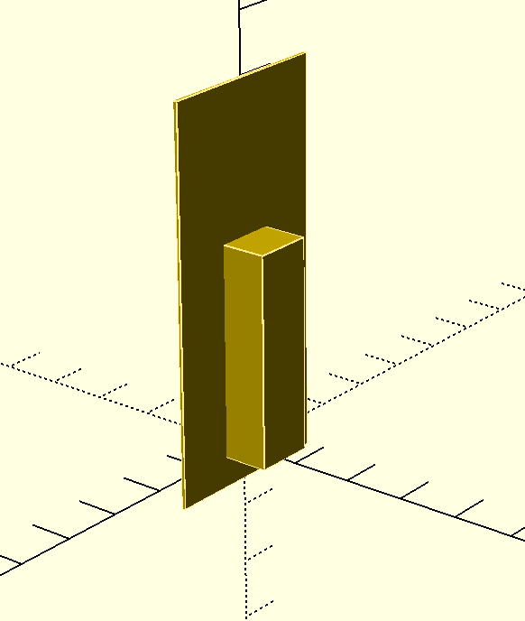
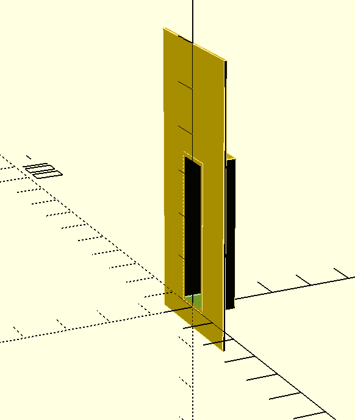
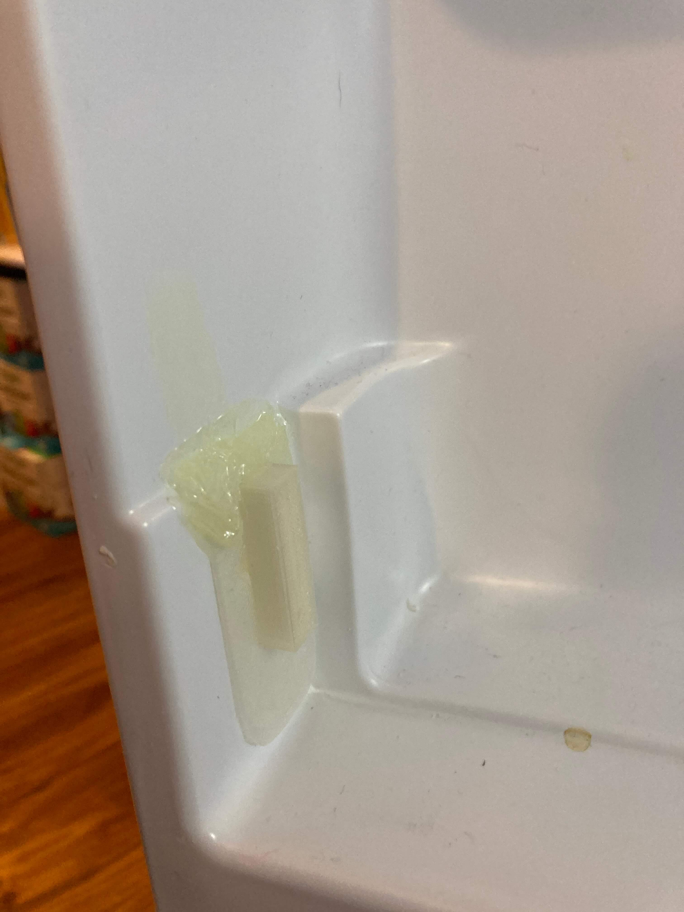
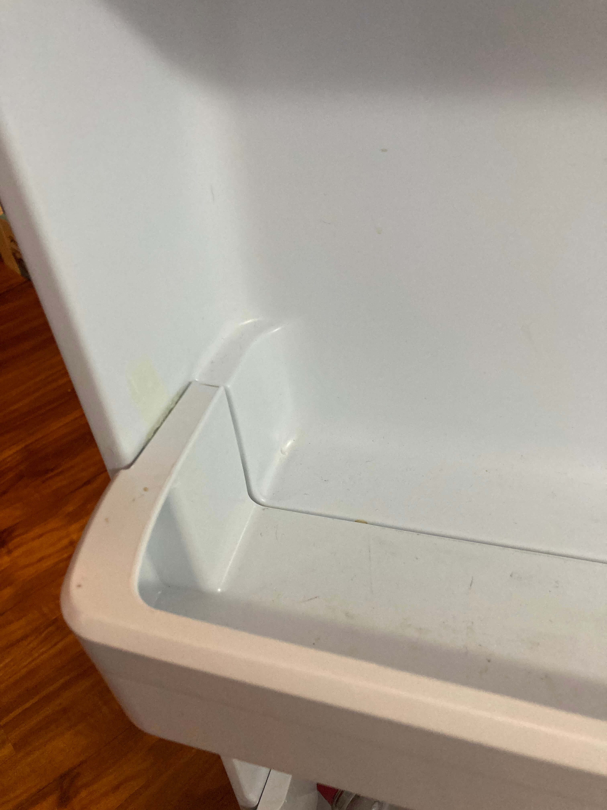
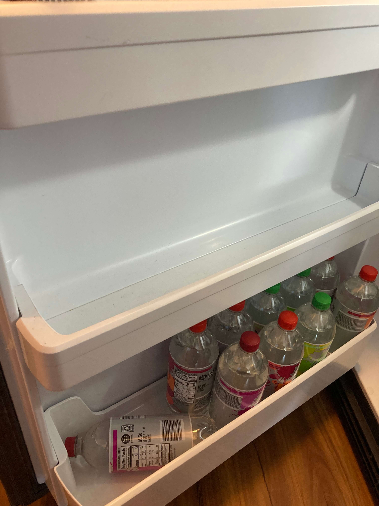

Title: Refrigerator Shelf Repair
Date: 2021-03-06
Tags: 3D, Repair



Our GE refrigerator shelf broke a few weeks ago.  The connector on the door side was really weak and poorly designed. 

Here is the other side to show you what it looks like when it is not broken. 




I decided to 3D print a replacement.  The design is fairly simple so I used [OpenSCAD](https://www.openscad.org/).  

```C++
difference() {
    union(){
        translate([-15, 0,-5]) cube([30,0.6,65]);
        translate([-5,0,0]) cube([10,8,35]);
    }
    translate([-4,-1,1]) cube([8,8,33]);
}
```




The final design had a large void which I printed with supports.  By leaving in the supports I was able to fill the void with epoxy to add strength to the design.  I also included a large 0.6mm brim to increase the glue surface area. 



When gluing this in, I used the shelf to hold it in place and a layer of cellophane wrap to protect shelf from getting glue on it while it dried.  The entire repair turned out great.  Just needs a little cleaning of the leftover glue residue. 


